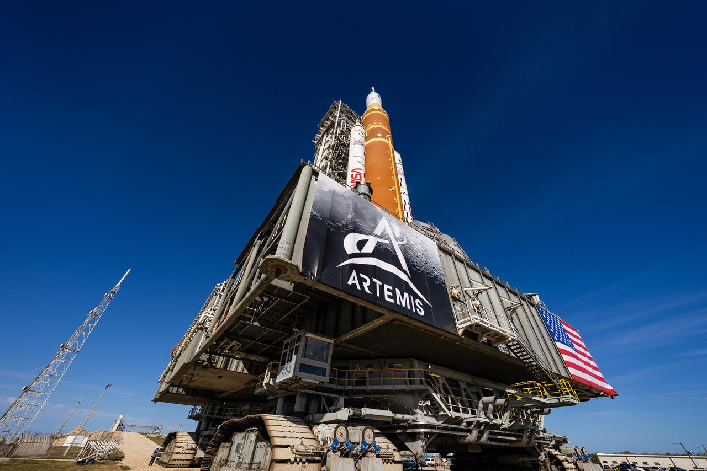

# CAS Space's Lijian-2 (Yao-1) Rocket Scores Maiden Flight Success, Places Three Satellites in Orbit

**Summary:** On March 30, 2026 at 19:00 Beijing Time, CAS Space's indigenously developed Lijian-2 (Yao-1) carrier rocket successfully lifted off from the Dongfeng Commercial Space Innovation Test Zone in Ejin Banner, Alxa League, Inner Mongolia, placing three satellites — Xinzhengcheng-01, Xinzhengcheng-02, and Tianshi-01 — into their target orbits. Lijian-2 is China's first rocket using the Common Booster Core (CBC) configuration, and its maiden flight already served national strategic and major engineering construction needs.

*Credit: NASA / Kennedy Space Center (public domain image, illustrating global rocket launch scenes)*

## Mission Overview

The Lijian-2 (PR-2) Yao-1 carrier rocket launched at 19:00 Beijing Time on March 30, 2026, from the Dongfeng Commercial Space Innovation Test Zone. Minutes later, it successfully placed the Xinzhengcheng-01, Xinzhengcheng-02, and Tianshi-01 satellites into their predetermined orbits, with the flight test mission declared a complete success.

This was the maiden flight of the Lijian-2 carrier rocket and the 12th launch of the Lijian series of launch vehicles.

## Rocket Specifications

Lijian-2 Yao-1 maiden flight configuration:

| Parameter | Value |
|-----------|-------|
| Payload fairing diameter | 4.2 m |
| Core stage diameter | 3.35 m |
| Stage 1 with boosters diameter | 5.8 m |
| Total length | 53 m |
| Liftoff mass | 625 t |
| Stages | Two-and-a-half |
| LEO payload capacity | 12 t |
| SSO payload capacity | 8 t (500 km) / 5.6 t (700 km) |

## Technical Highlights

As China's first rocket using the Common Booster Core (CBC) configuration, Lijian-2 features a universal core stage with a 3.35 m diameter, offering modular and standardized characteristics that allow payload capacity adjustments through varying booster configurations.

Lijian-2 Deputy Chief Designer Lian Jie stated that this maiden flight already serves national strategic and major engineering construction needs. The rocket achieves a balance between large payload capacity and low cost in its design, and will explore new space-to-ground transportation models.

## Commercial Significance

The successful maiden flight of Lijian-2 marks the accelerated transition of China's private commercial rockets from "experimental products" to "operational systems." With reusable rocket technology entering an intensive verification phase and the commercial space supply chain gradually maturing, China's commercial space sector is moving from technology validation into large-scale engineering, providing strong support for the target of over 60 commercial launches in 2026.

## Sources (original pages)

- [Lijian-2 Yao-1 Carrier Rocket Maiden Flight Successful](https://new.qq.com/rain/a/20260330A08CGD00) (CCTV News)
- [One Arrow, Three Satellites! Lijian-2 Yao-1 Carrier Rocket Launch Successful](https://new.qq.com/rain/a/20260330A0874T00) (Beijing News)
- [Lijian-2 Carrier Rocket Maiden Flight Successful, to Explore New Space Transportation Models](https://so.html5.qq.com/page/real/search_news?docid=70000021_89969cb16e536252) (CNR)
- [Lijian-2 Maiden Flight Fully Successful, CAS Space Builds New Advantages in Commercial Space Large Payload Capacity](https://so.html5.qq.com/page/real/search_news?docid=70000021_14969ca874567552) (CNR)
