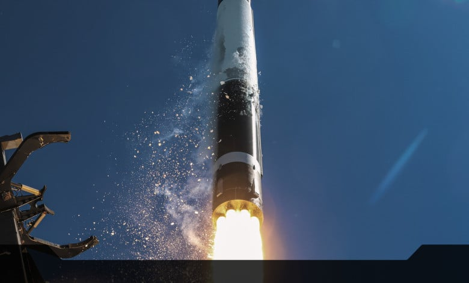

# iQPS Books Three Additional Electron Launches, Deepening Multi-Year Partnership with Rocket Lab

**Summary:** On April 9, 2026, Japanese radar satellite operator iQPS (iQPS Inc.) signed an agreement with Rocket Lab for three additional Electron rocket launches, further deepening their years-long partnership. iQPS operates a synthetic aperture radar (SAR) constellation focused on monitoring the Kyushu region. This contract reinforces Rocket Lab's position as the preferred launch provider for Japanese satellites.

*Credit: Rocket Lab USA*

## Contract Background

iQPS is a leading Japanese radar satellite operator, with a constellation dedicated to monitoring the Kyushu region and providing all-weather, round-the-clock Earth observation capabilities. As its business scales, iQPS continues to expand its launch partnership with Rocket Lab.

Under the new agreement, iQPS will continue to utilize Rocket Lab's dedicated launch services across multiple future Electron missions, ensuring its satellites enter orbit on schedule to support business expansion plans.

## Deepening the Partnership

The iQPS-Rocket Lab partnership spans multiple years and includes several previous launch missions. This additional booking of three launches marks a further deepening of the collaboration. Rocket Lab provides iQPS with end-to-end exclusive launch services—from satellite integration to launch execution—demonstrating Electron's sustained competitiveness in the small-payload dedicated launch market.

iQPS's radar satellite constellation enables regular monitoring of ground targets, with broad application prospects in natural disaster assessment, maritime surveillance, and infrastructure inspection.

## Sources (original articles)

- [iQPS Books Three New Launches on Electron, Extending Multi-Year Partnership with Rocket Lab](https://www.rocketlabusa.com/updates/iqps-books-three-new-launches-on-electron-extending-multi-year-partnership-with-rocket-lab/)
