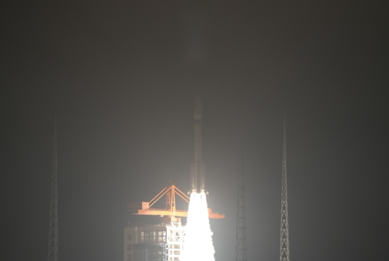

# China Launches 21 Satellite Internet LEO Satellites

**Summary:** At 03:38 UTC on April 9, 2026, China successfully launched a batch of 21 low-Earth-orbit satellites for its satellite internet constellation, using the Long March 6 Modified (长征六号改) rocket from the Taiyuan Satellite Launch Center. The satellites entered their preset orbits and the launch was declared a complete success. This was the 637th flight of the Long March launch vehicle series.

*Credit: CNSA*

## Mission Overview

At 03:38 UTC (11:38 Beijing time) on April 9, 2026, China launched a constellation of 21 low-Earth-orbit (LEO) satellites for its national satellite internet network, aboard a Long March 6 Modified rocket from the Taiyuan Satellite Launch Center. The satellites reached their preset orbits and the launch was declared a complete success.

This launch marked the 637th flight of China's Long March launch vehicle family, a significant milestone in the country's expanding satellite internet infrastructure.

## Significance for China's Satellite Internet Ambitions

The low-Earth-orbit satellite internet constellation represents a major national strategic initiative for next-generation communication networks. LEO satellites offer advantages including extensive coverage, low latency, and rapid deployment, enabling broadband access in remote areas while also serving emergency communications, IoT connectivity, and navigation augmentation applications.

This launch further expands China's LEO satellite internet constellation, contributing to the development of an integrated space-ground information network.

## Sources (original pages)

- [我国成功发射卫星互联网低轨21组卫星 (CNSA)](https://www.cnsa.gov.cn/n6758823/n6758838/c10738139/content.html)
