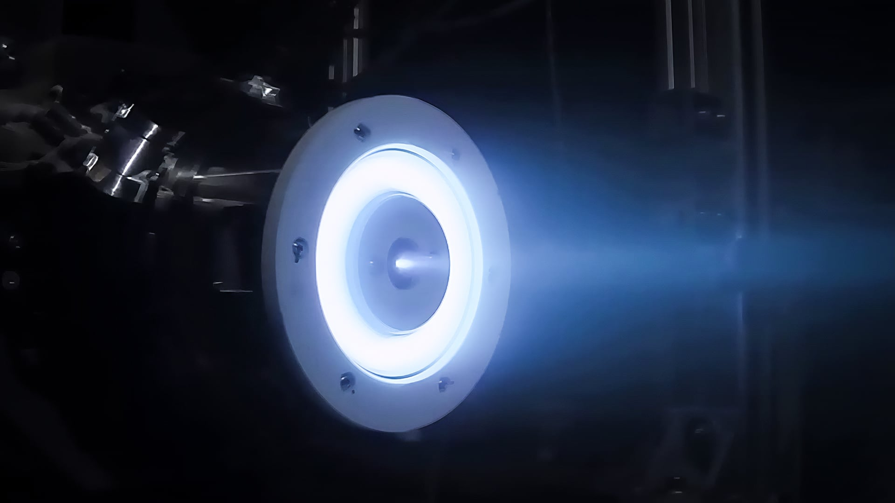

# Rocket Lab Unveils New Gauss Hall-Effect Propulsion System Designed for Mass Production Constellations

**Summary:** On April 14, 2026, Rocket Lab introduced the Gauss series of new Hall-effect satellite thrusters in Long Beach, California. Designed for high-volume production to meet the growing demand for reliable satellite positioning across mega-constellations ranging from hundreds to tens of thousands of satellites, the system marks a new era of commercial satellite propulsion technology entering mass production.

*Credit: Rocket Lab*

## Sources

- [Rocket Lab Unveils New Electric Propulsion Satellite Thruster to Meet Constellation Demand](https://www.rocketlabusa.com/updates/rocket-lab-unveils-new-electric-propulsion-satellite-thruster-to-meet-constellation-demand/)