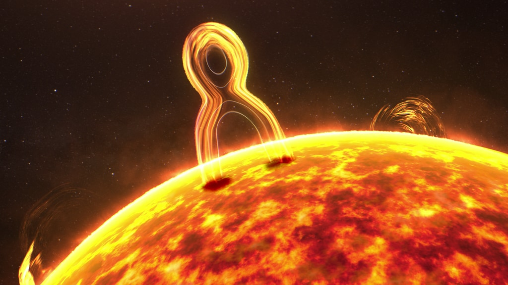

# NASA's Parker Solar Probe Finds Surprises in Solar Explosion

**Summary:** On April 15, 2026, NASA released new research findings: Parker Solar Probe, during a 2022 solar flyby, passed through a magnetic reconnection event region and captured detailed data on charged particle acceleration. Surprisingly, the observations revealed that protons and heavy ions accelerate differently—this contradicts theoretical predictions that both particle types should follow the same mechanism.

*Credit: NASA (Public Domain)*

## Discovery: Different Particle Acceleration Mechanisms

Before a solar storm races across space and impacts technology on Earth, it starts with an explosive process on the Sun known as magnetic reconnection. Magnetic reconnection is when the Sun's magnetic field suddenly reconfigures and releases enormous energy, flinging particles to dangerous speeds.

During a 2022 solar flyby, Parker Solar Probe passed in between the Sun and the site of a magnetic reconnection event in the solar wind—the continual stream of particles and magnetic fields emitted by the Sun. Since storm-causing reconnection events in the solar atmosphere are difficult to access directly, events occurring in the solar wind offer an opportunity to take direct measurements of particles accelerated by magnetic reconnection. And Parker Solar Probe did just that.

Parker Solar Probe observed a Sun-directed jet of particles made of protons and heavy ions—elements with extra electrons. But unexpectedly, analysis of the data revealed that protons and ions were accelerated in different manners. Magnetic reconnection theories expect these two types of particles to be accelerated in the same manner, but the new observations showed the protons formed a dispersed beam, like that from a flashlight, while the heavier ions were directed in a straight line like a laser beam.

## Scientific Significance

"These observations challenge our fundamental understanding of how magnetic reconnection accelerates particles," said Karl Battams of the U.S. Naval Research Laboratory, principal investigator for SOHO's coronagraph. "Parker Solar Probe is providing unprecedented detailed data helping scientists understand the Sun—our star that life on Earth depends on."

## Parker Solar Probe Mission Overview

Launched in 2018, Parker Solar Probe is humanity's first spacecraft to fly into the Sun's corona. Its primary objectives include:
- Tracing how solar energy heats the corona and accelerates the solar wind
- Determining the transport and dissipation mechanisms of solar plasma
- Exploring the acceleration and transport processes of high-energy particles

*Credit: NASA (Public Domain)*

## Sources (original pages)

- [NASA Science: NASA's Parker Solar Probe Finds Explosive Surprises on Sun](https://science.nasa.gov/blogs/science-news/2026/04/15/science-nasa-gov-parker-solar-probe-finds-explosive-surprises-on-sun/)

> Translated from NASA Science news, published April 15, 2026.
