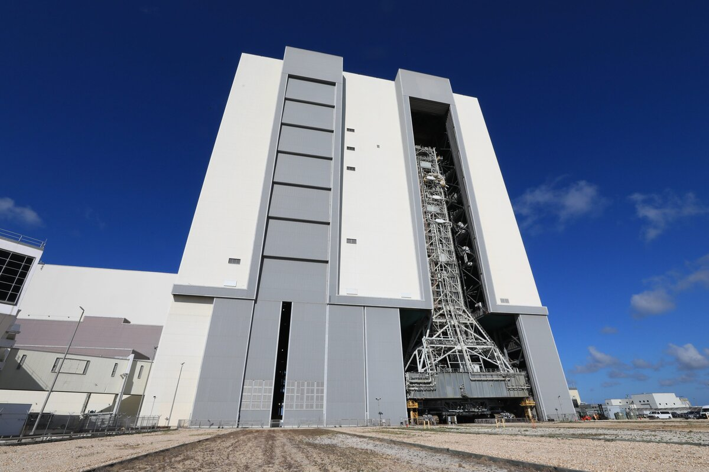

# NASA's Mobile Launcher Returns to VAB Ahead of Artemis III Mission

**Summary:** From April 16 to 17, 2026, NASA transported the Mobile Launcher 1 used in the Artemis II mission from Launch Complex 39B back to the Vehicle Assembly Building (VAB) at Kennedy Space Center, initiating rocket stacking preparations for the Artemis III crewed lunar landing mission targeted for 2027. The 380-foot-tall mobile launcher traveled approximately 4 miles over 8 to 12 hours.

*Credit: NASA (Public Domain)*

## Sources (original pages)

- [NASA's Mobile Launcher Arrives at Vehicle Assembly Building](https://www.nasa.gov/blogs/missions/2026/04/17/nasas-mobile-launcher-arrives-at-vehicle-assembly-building/)

> This report is based on information published by NASA's official mission blog on April 17, 2026.
