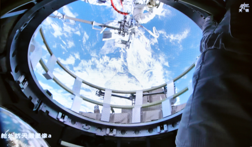

# Shenzhou 21 Crew Completes Third EVA, Commander Zhang Lu Sets New Record

**Summary:** At approximately 01:36 Beijing Time on April 17, 2026, Shenzhou 21 crew members Zhang Lu, Wu Fei and Zhang Hongzhang worked in close coordination, with support from the space station's robotic arm and ground-based scientists, to successfully complete a 5.5-hour extravehicular activity (EVA). The crew installed space debris shielding and conducted external equipment inspections. Commander Zhang Lu has now completed 7 EVAs in total, setting China's record for the most spacewalks by a single astronaut.

*Credit: China Manned Space Engineering Office*

## Mission Details

The EVA began at approximately 01:36 Beijing Time on April 17, 2026, and concluded around 07:06, lasting approximately 5.5 hours. With support from the space station's robotic arm and ground-based scientific personnel, the three astronauts successfully completed the following tasks:

- **Space debris shielding installation**: Installed protective devices on the exterior of the space station to ensure long-term safe operation
- **External equipment inspection**: Conducted comprehensive inspections and maintenance of key external equipment

Astronauts Zhang Lu and Wu Fei safely returned to the Wentian experiment module, and the EVA was a complete success.

## Commander Zhang Lu: 7 EVAs, Setting a New Record

Following this EVA, astronaut Zhang Lu has now completed 7 spacewalks in total, setting China's record for the most EVAs by a single astronaut. As commander of the Shenzhou 21 crew, Zhang Lu has demonstrated exceptional professionalism and skill throughout each EVA, fully embodying the qualities of China's astronaut corps.

## Crew On-Orbit Progress

Since successfully completing their second EVA on March 16, the Shenzhou 21 crew has steadily advanced their on-orbit operations:

- Continued space life science and human research
- Advanced experiments in microgravity physics and other scientific domains
- Conducted in-station environmental monitoring, equipment inspection and maintenance, and supplies organization
- Completed full-system pressure emergency drills, emergency rescue training, and EVA preparation

The three astronauts have now been aboard the space station for over 5 months and remain in good health and working condition.

## Extended Mission Duration

To further validate technologies related to long-duration human spaceflight and maximize the comprehensive benefits of Shenzhou 22's emergency launch capability for space station resupply, a thorough evaluation has determined that the crew's orbital residence will be extended by approximately one additional month.

## Sources (original pages)

- [Shenzhou 21 Crew Completes Third Extravehicular Activity - CMSA](http://www.cmse.gov.cn/xwzx/202604/t20260417_57413.html)
