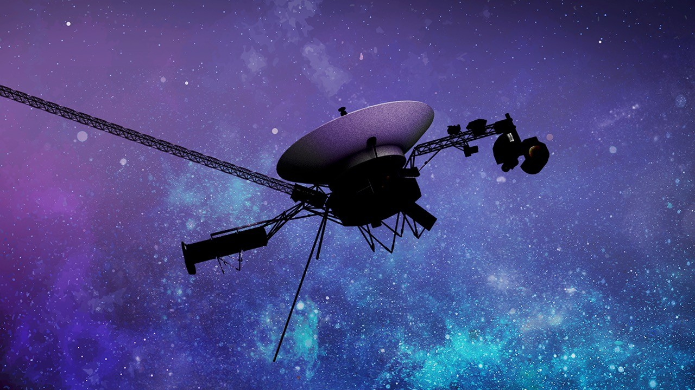

# NASA Shuts Off Instrument on Voyager 1 to Keep Spacecraft Operating

**Summary:** On April 17, 2026, engineers at NASA's Jet Propulsion Laboratory (JPL) in Southern California sent commands to shut down an instrument aboard Voyager 1 called the Low-energy Charged Particles experiment (LECP). The nuclear-powered spacecraft, now over 15 billion miles (25 billion kilometers) from Earth, is running low on power, and turning off LECP is considered the best way to keep humanity's first interstellar explorer operational.

*Credit: NASA / JPL-Caltech (Public Domain)*

## Background: Power Crisis and Instrument Shutdown

Launched in 1977, Voyager 1 has been flying through deep space for nearly 49 years. Its nuclear power source is gradually depleting, and engineers have been working to find ways to extend its mission.

During a routine, planned roll maneuver on February 27, 2026, Voyager 1's power levels fell unexpectedly. Mission engineers knew any additional drop in power could trigger the spacecraft's undervoltage fault protection system, which would shut down components on its own to safeguard the probe, requiring recovery by the flight team—a lengthy process that carries its own risks.

"While shutting down a science instrument is not anybody's preference, it is the best option available," said Kareem Badaruddin, Voyager mission manager at JPL. "Voyager 1 still has two remaining operating science instruments—one that listens to plasma waves and one that measures magnetic fields. They are still working great, sending back data from a region of space no other human-made craft has ever explored. The team remains focused on keeping both Voyagers going for as long as possible."

## Command Transmission and Shutdown Process

Because Voyager 1 is more than 15 billion miles (25 billion kilometers) from Earth, the sequence of commands to shut down the instrument takes about 23 hours to reach the spacecraft, and the shutdown process itself takes about three hours and 15 minutes to complete.

One part of the LECP—a small motor that spins the sensor in a circle to scan in all directions—will remain on. It uses only 0.5 watts of power, and keeping it running gives the team the best chance of being able to turn the instrument back on someday if they find extra power.

## Extended Mission Plan: "The Big Bang"

Engineers are confident that shutting down the LECP will give Voyager 1 about a year of breathing room. They are using the time to finalize a more ambitious energy-saving fix for both Voyagers they call "the Big Bang," which is designed to further extend Voyager operations. The idea is to swap out a group of powered devices all at once—hence the nickname—turning some things off and replacing them with lower-power alternatives to keep the spacecraft warm enough to continue gathering science data.

*Credit: NASA (Public Domain)*

## Sources (original pages)

- [NASA Science: NASA Shuts Off Instrument on Voyager 1 to Keep Spacecraft Operating](https://science.nasa.gov/blogs/voyager/2026/04/17/nasa-shuts-off-instrument-on-voyager-1-to-keep-spacecraft-operating/)

> Translated from NASA Science news, published April 17, 2026.
