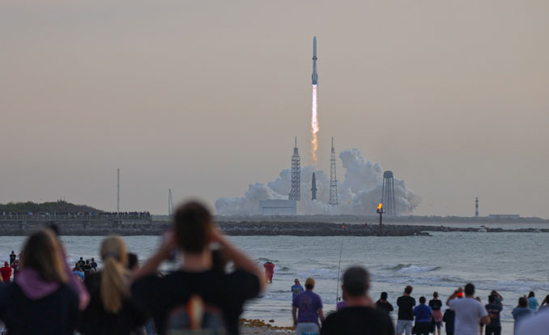

*Credit: Spaceflight Now*

**Summary:** On April 19, 2026, Blue Origin launched its third New Glenn rocket from Cape Canaveral Space Force Station, Florida. The company successfully recovered and reused a previously flown booster for the first time. However, the payload — a direct-to-cellphone communications satellite — failed to reach its intended orbit, a defect confirmed by the company.

## Event Details

The New Glenn rocket lifted off in the early morning hours and the booster successfully separated and landed on a drone ship, marking Blue Origin's first-ever reuse of a previously flown booster. However, the satellite was confirmed to have failed to achieve its target orbit after separation.

This was the third flight of Blue Origin's New Glenn rocket and a significant milestone in the company's push toward reusable launch vehicle technology. While the booster recovery was successful, the payload orbit failure remains a technical issue requiring further investigation.

## Background

New Glenn is Blue Origin's large launch vehicle designed to compete in the commercial satellite launch market. This mission was intended to deliver a direct-to-cellphone communications satellite to a geostationary transfer orbit. The specific cause of the orbit anomaly is still under investigation.

## Sources (original pages)

- [Blue Origin launches third New Glenn rocket, but payload ends up in wrong orbit (Spaceflight Now)](https://spaceflightnow.com/2026/04/20/blue-origin-launches-third-new-glenn-rocket-but-payload-ends-up-in-wrong-orbit/)
