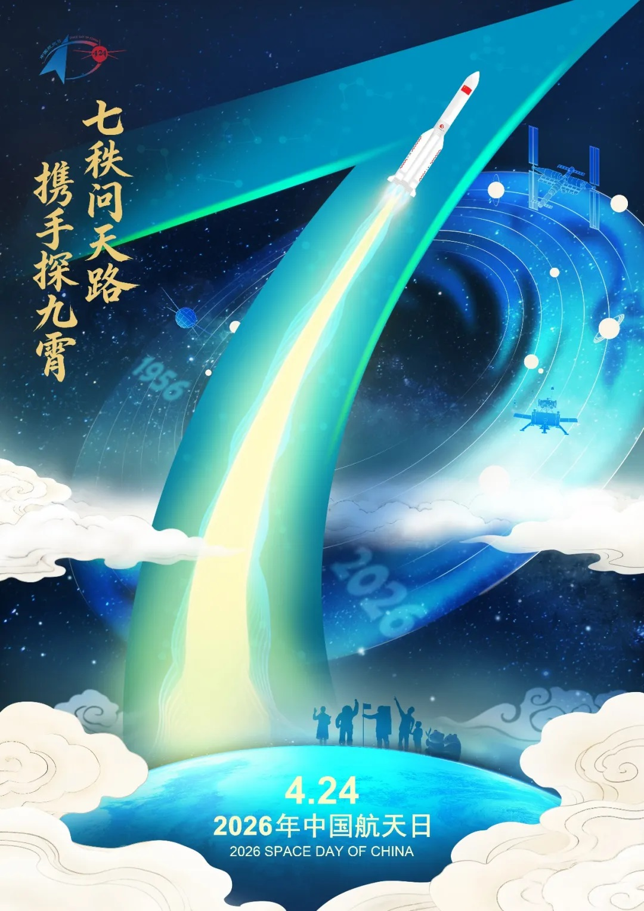

# China Space Day 2026 Activities Announced

**Summary:** On April 17, 2026, China's National Space Administration (CNSA) held a press conference in Beijing to announce the activities for the 11th China Space Day on April 24. This year's event coincides with the 70th anniversary of China's space industry and the 10th anniversary of Space Day, themed "70 Years of Exploring the Celestial Path, Together We Reach for the Stars." The main venue will be in Chengdu, Sichuan Province, with Brazil as the guest of honor. Key announcements regarding deep space exploration, commercial spaceflight, and Chang'e-5 lunar sample research are expected.

*Credit: CNSA*

## Sources (original pages)

- [CNSA: 2026 China Space Day Press Conference](https://www.cnsa.gov.cn/n6758823/n6758838/c10739797/content.html)

> April 24, 2026 marks the 11th China Space Day, coinciding with the 70th anniversary of China's space industry and the 10th anniversary of Space Day. The main event is in Chengdu, with Brazil as guest of honor.

On April 17, China's National Space Administration held a press conference in Beijing announcing the 2026 China Space Day activities. Officials from CNSA, the Sichuan Provincial People's Government, the Chengdu Municipal People's Government, and Sichuan University presented details about the upcoming events.

The 11th China Space Day on April 24, 2026 coincides with the 70th anniversary of China's space industry and the 10th anniversary of Space Day. Themed "70 Years of Exploring the Celestial Path, Together We Reach for the Stars," the main events will be held in Chengdu, Sichuan Province, co-organized by the Ministry of Industry and Information Technology, CNSA, and the Sichuan Provincial People's Government, hosted by the Chengdu Municipal People's Government and Sichuan University. Brazil has been invited as the guest of honor.

The main activities include the opening ceremony, a series of space science exhibitions, and a Space Culture and Art Forum. The China Space Conference, space outreach programs in schools, and technical exchange events will be held concurrently. The opening ceremony will take place on the morning of April 24 at the Chengdu Century City International Exhibition Center, where a thematic promotional video and theme song will be released, the 2026 "China Space Public Welfare Ambassador" will be announced, and awards including the 2025 Qian Xuesen Highest Achievement Award, Outstanding Contribution Award, and Innovation Team Award from the China Space Foundation will be presented. Major announcements regarding deep space exploration, commercial spaceflight, and the latest research findings from Chang'e-5 lunar samples will also be disclosed.

A space science exhibition will run from April 24 to May 5 at the Chengdu Century City International Exhibition Center, showcasing space technology, space science, space applications, commercial spaceflight, and Sichuan's aerospace industry achievements through models and exhibits.

During the China Space Day period, more than 30 provinces, municipalities, and autonomous regions across China will host space open days, science lectures, competitions, and seminars. A number of space academicians and experts will visit schools to deliver space science presentations to students. The first lunar-themed feature film "Moon Landing" is scheduled to premiere during the Space Day period.
