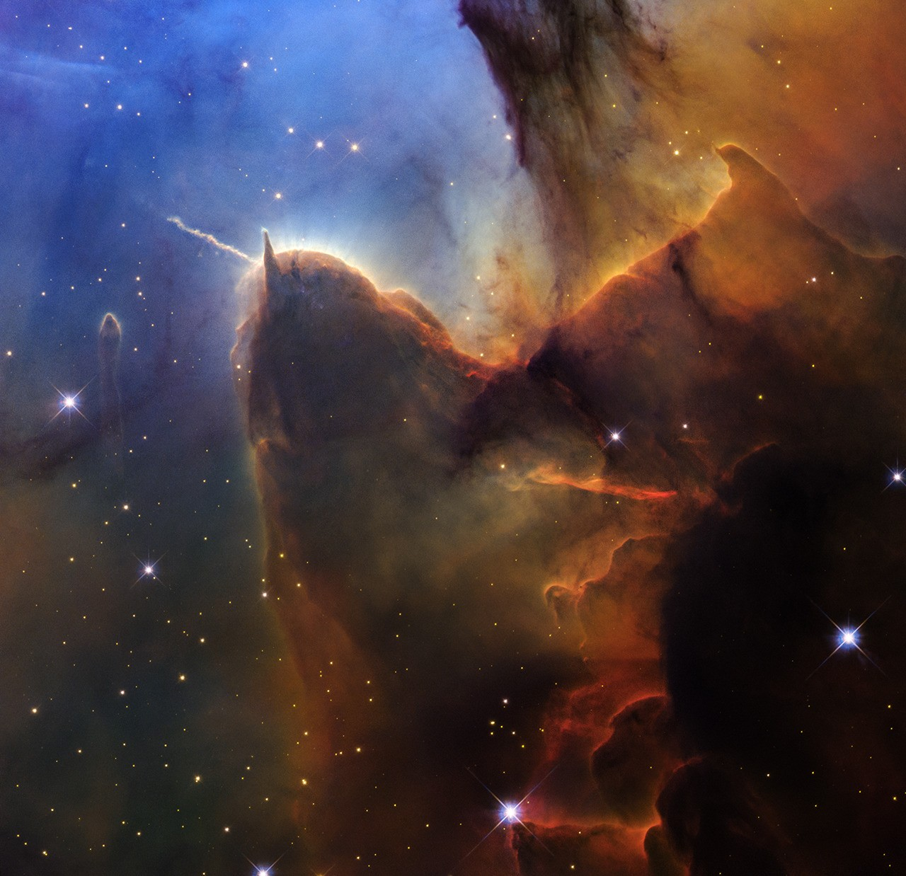

# NASA Hubble Telescope Releases New Image of Trifid Nebula for 36th Launch Anniversary

**Summary:** April 24, 2026 marks the 36th anniversary of NASA's Hubble Space Telescope launch. NASA and ESA released a stunning new visible-light image of the Trifid Nebula (M20), a star-forming region in the constellation Sagittarius approximately 5,500 light-years from Earth. Using its upgraded Wide Field Camera 3 (WFC3), Hubble captured the nebula with significantly higher resolution than in 1997, revealing changes in the star-forming region on humanly perceptible timescales.

*Credit: NASA, ESA, STScI; Image Processing: Joseph DePasquale (STScI)*

The Trifid Nebula is a well-known emission nebula and star-forming region, named for the dark dust lanes that appear to divide it into three lobes in visible light. Hubble first photographed the nebula in 1997 using the Wide Field Planetary Camera 2 (WFPC2), shortly after its second servicing mission. The new image, captured with the third-generation WFC3 instrument, reveals sharper details and a broader wavelength range.

The observable structural changes in the nebula's gas over the 29-year interval between observations provide compelling evidence of the ongoing stellar birth process within the Trifid — and underscore the scientific value of Hubble's long-duration orbital operations. Hubble was launched aboard the Space Shuttle Discovery on April 24, 1990, and remains one of the most productive scientific instruments in human history.

## Sources (original pages)

- [NASA: NASA's Hubble Dazzles With Young Stars in Trifid Nebula](https://science.nasa.gov/missions/hubble/nasas-hubble-dazzles-with-young-stars-in-trifid-nebula/)
