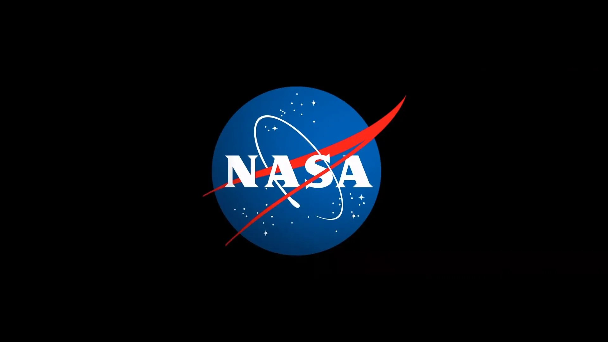

# Latvia to Sign Artemis Accords on April 20

**Summary:** Latvia will sign the Artemis Accords during a ceremony at NASA Headquarters on Monday, April 20, 2026, becoming the 50th-plus signatory of the international space exploration cooperation framework. NASA Administrator Jared Isaacman will host the ceremony at the James E. Webb Memorial Auditorium.

*Credit: NASA (Public Domain)*

## Sources (original pages)

- [NASA: NASA Invites Media to Latvia Artemis Accords Signing Ceremony](https://www.nasa.gov/news-release/nasa-invites-media-to-latvia-artemis-accords-signing-ceremony/)

> Latvia will sign the Artemis Accords on April 20 at NASA Headquarters, becoming the 50th-plus signatory.

In 2020, during the first Trump Administration, the United States, led by NASA and the State Department, joined with seven other founding nations to establish the Artemis Accords, responding to the growing interest in lunar activities by both governments and private companies.

The Artemis Accords introduced the first set of practical principles aimed at enhancing the safety, transparency, and coordination of civil space exploration on the Moon, Mars, and beyond. Latvia will be the 50th-plus nation to sign.

The signing ceremony will take place at 9 a.m. EDT on April 20 at the James E. Webb Memorial Auditorium at NASA Headquarters in the Mary W. Jackson building at 300 E Street SW. NASA Administrator Jared Isaacman will host the ceremony, with Latvia's Minister for Education and Science Dace Melnbārde, Chargé d'Affaires Jānis Bekāris at the Embassy of the Republic of Latvia to the United States, and Jacob Helberg, Under Secretary of State for Economic Affairs at the U.S. Department of State, attending.
