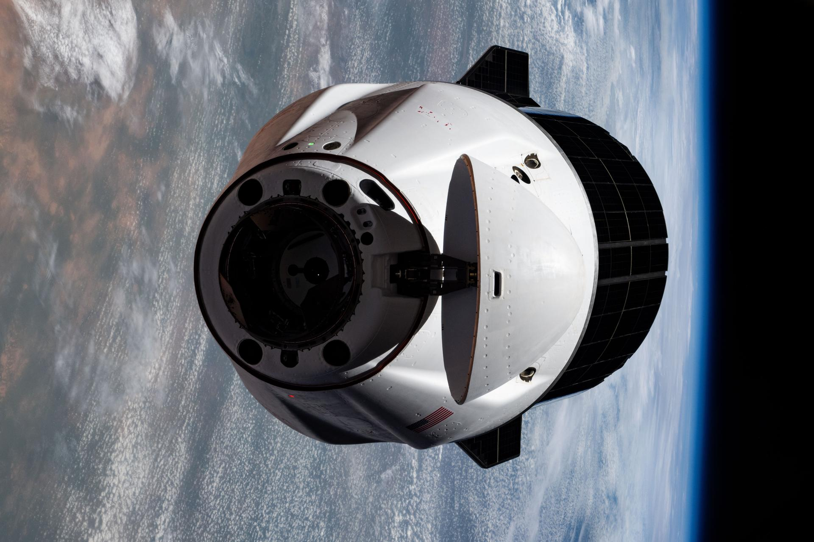

# NASA Invites Media to SpaceX's 34th Commercial Resupply Mission, Targeting May 12 Launch

**Summary:** On April 20, 2026, NASA released a media advisory inviting media to cover SpaceX's 34th Commercial Resupply Services (CRS-34) mission, targeted for launch no earlier than Tuesday, May 12, from Space Launch Complex 40 at Cape Canaveral Space Force Station in Florida. The mission will deliver over 5 metric tons of science investigations, supplies, and equipment to the International Space Station. The application deadline for U.S. citizen media is 11:59 p.m. EDT on Wednesday, April 29.

*Credit: NASA (Public Domain)*

## Mission Overview

The SpaceX CRS-34 mission is part of NASA's Commercial Resupply Services program, delivering science investigations, supplies, and equipment to the International Space Station. According to NASA's media advisory, the mission is targeted for launch **no earlier than Tuesday, May 12**, from **Space Launch Complex 40 (SLC-40)** at Cape Canaveral Space Force Station in Florida.

This mission will deliver over 5 metric tons of cargo, including:

- **Biology and Biotechnology**: Life science experiment equipment
- **Earth and Space Science**: Earth observation and space science instruments
- **Physical Sciences**: Microgravity physics experiment materials
- **Technology Development and Demonstration**: New technology demonstration payloads

## Media Accreditation

NASA media accreditation to cover prelaunch and launch activities is open for this mission. **The application deadline for U.S. citizens is 11:59 p.m. EDT on Wednesday, April 29.** All accreditation requests must be submitted by the deadline.

Media accreditation portal: https://media.ksc.nasa.gov

Credentialed media will receive a confirmation email after approval. NASA's media accreditation policy is available online.

## Launch Information

| Item | Details |
|------|---------|
| Rocket | Falcon 9 Block 5 |
| Spacecraft | Dragon spacecraft |
| Launch Site | Cape Canaveral SFS SLC-40 |
| Mission | CRS-34 — 34th Commercial Resupply Services |
| Payload | Over 5 metric tons of science, supplies, and equipment |

## Significance of CRS-34

Each resupply mission to the space station delivers critical science experiments and equipment supporting microgravity research. CRS-34 will continue advancing the International Space Station's role as a platform for microgravity research, supporting experiments across materials science, life sciences, physical sciences, and Earth observation.

## Sources (original pages)

- [NASA: NASA Invites Media to SpaceX's 34th Resupply Launch to Space Station](https://www.nasa.gov/news-release/nasa-invites-media-to-spacexs-34th-resupply-launch-to-space-station/)
