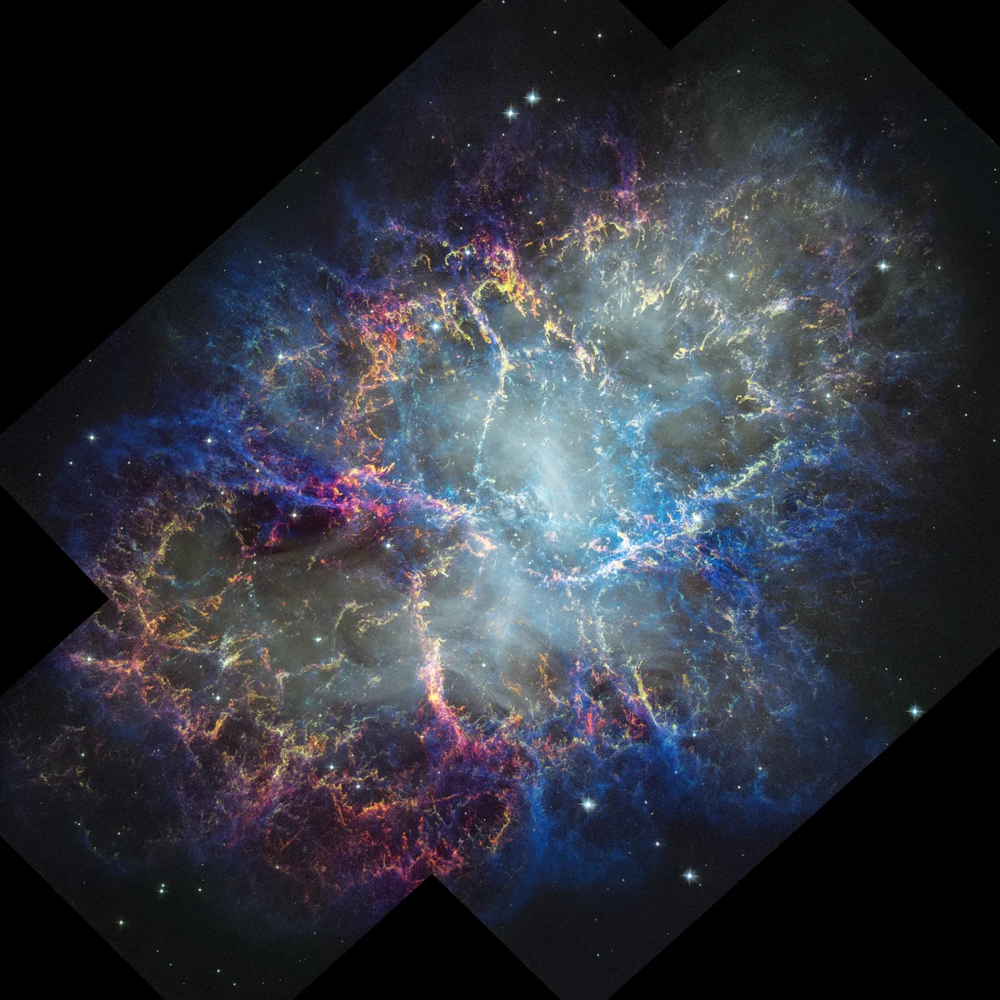

# NASA Hubble Releases Stunning New Image of the Crab Nebula on Its 36th Anniversary

**Summary:** NASA has released a spectacular new image of the Crab Nebula captured by the Hubble Space Telescope, offering an unparalleled, detailed look at the aftermath of a supernova and how it has evolved over the telescope's 36-year lifetime. The image reveals that the nebula's filamentary structure is expanding at a pace of 3.4 million miles per hour.

*Credit: NASA, ESA, STScI, William Blair (JHU); Image Processing: Joseph DePasquale (STScI)*

The Crab Nebula, the result of a supernova explosion observed by Chinese astronomers in 1054 AD, has been one of Hubble's most-studied targets since its launch in 1990. This new observation, released on March 23, 2026 and featured by NASA on April 21, represents a landmark achievement in multi-wavelength astronomy.

The image captures the nebula's intricate filamentary structure, as well as the considerable outward movement of those filaments over 25 years. By combining this fresh Hubble observation with past Hubble data and observations from other telescopes, astronomers can now study how the supernova remnant is expanding and evolving over time with unprecedented precision.

"This observation gives us the most detailed look at how the Crab Nebula has changed over the span of a generation," the Hubble mission team noted. The expansion velocity of 3.4 million miles per hour (approximately 1.5 million meters per second) reflects the tremendous energy released during the original stellar explosion.

The Crab Nebula spans approximately 10 light-years and is located about 6,500 light-years from Earth in the constellation Taurus. At its center lies a pulsar — a rapidly spinning neutron star — that is the remnant of the original star's collapsed core.

## Sources (original pages)

- [NASA: A Fresh Look at the Crab Nebula](https://www.nasa.gov/image-article/a-fresh-look-at-the-crab-nebula/)
