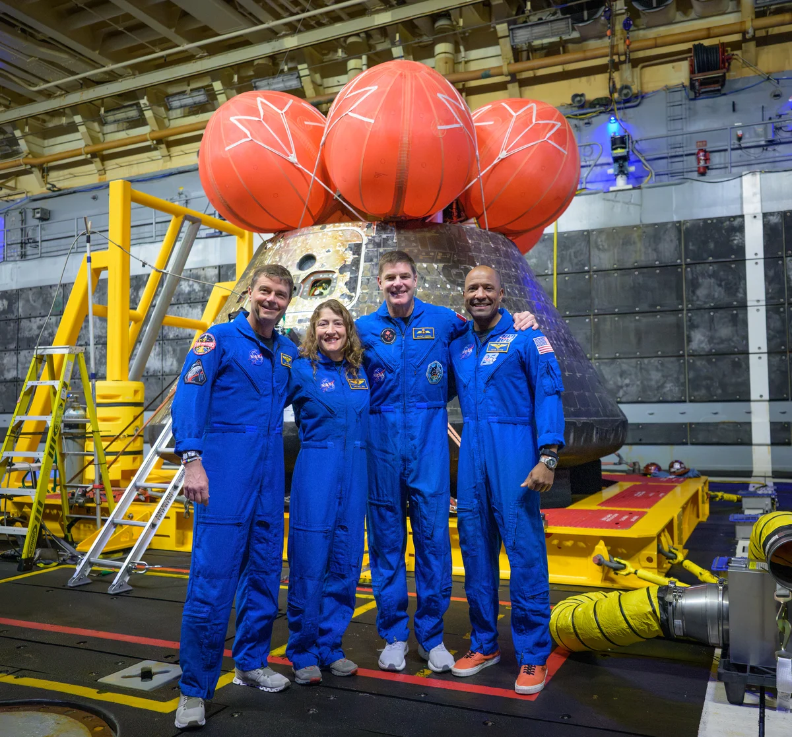

# NASA Ames Provides Key Technologies for Artemis II Mission

**Summary:** NASA's Ames Research Center in California's Silicon Valley played a critical role in the Artemis II mission, developing heat shield sensors, validating SLS rocket strakes through wind tunnel testing and supercomputer modeling, and guiding the crew through lunar observations. These contributions ensured astronaut safety during 5,000°F reentry and gathered unique data for future lunar exploration.

*Credit: NASA / Bill Ingalls (Public Domain)*

## Heat Shield Sensors: Data for Atmospheric Reentry

During Artemis II, the Orion spacecraft reentered Earth's atmosphere at approximately 25,000 mph, with heat shield surface temperatures reaching 5,000 degrees Fahrenheit. Ames engineers developed a suite of sensors to provide real-time temperature and pressure data during reentry, providing critical information for mission safety assessment.

Ames also contributed to Orion's 3D-MAT compression pads, which connect the crew module to the service module. This technology maintains structural strength under extreme heat while providing thermal insulation for the spacecraft. Developed through NASA's Small Business Innovation Research / Small Business Technology Transfer (SBIR/STTR) program, 3D-MAT demonstrates how NASA innovations can impact human spaceflight and beyond.

## SLS Rocket Strakes: Wind Tunnels and Supercomputers

During Artemis I, the Space Launch System (SLS) rocket experienced higher-than-expected vibrations near the solid rocket booster attach points. The Ames team validated the solution—adding four strakes (thin, fin-like structures) to the SLS core stage—through supercomputer modeling and advanced wind tunnel testing using Unsteady Pressure Sensitive Paint and high-speed cameras.

The team also analyzed larger-than-expected debris impacts observed during Artemis I and supported real-time aerodynamic data and debris analysis monitoring during launch operations.

## Lunar Science Observations: Training Astronaut Eyes

As members of the Artemis II lunar science team, Ames scientists collaborated with flight operations at NASA's Johnson Space Center to guide the crew through lunar observations during the flyby. Key science objectives included studying lunar color, impact history, tectonic features, and future landing sites, as well as characterizing dynamic events such as impact flashes.

Ames scientists spent several years training the Artemis II crew to use their eyes—remarkably sensitive instruments—to observe, describe, and interpret geologic variations in lunar features. A timeline of targeted observations built by the lunar science team guided the crew to describe and photograph specific lunar targets, including craters, volcanic formations, and surface colorations.

## Mission Assurance: Software and Simulation Tools

Ames supported mission assurance through its Mission and Fault Management team, which helps NASA anticipate and respond to potential problems through system testing, software verification, and simulation scenario testing. The Cross-Program Integrated Data Systems team at Ames developed a suite of software products to support flight readiness, risk assessment, and decision making.

During Artemis II, Ames experts served as backup console operators and contributed to real-time analysis. Currently, Ames experts are heavily involved in post-flight data analysis assessing the performance of the Mission and Fault Management logic during the Artemis II flight.

---

## Sources (Original Pages)

- [What Are Ames' Contributions to Artemis II? - NASA](https://www.nasa.gov/centers-and-facilities/ames/what-are-ames-contributions-to-artemis-ii/)
- [Artemis II Mission Milestones: An Image and Video Recap - NASA](https://www.nasa.gov/centers-and-facilities/johnson/artemis-ii-mission-milestones-an-image-and-video-recap/)
