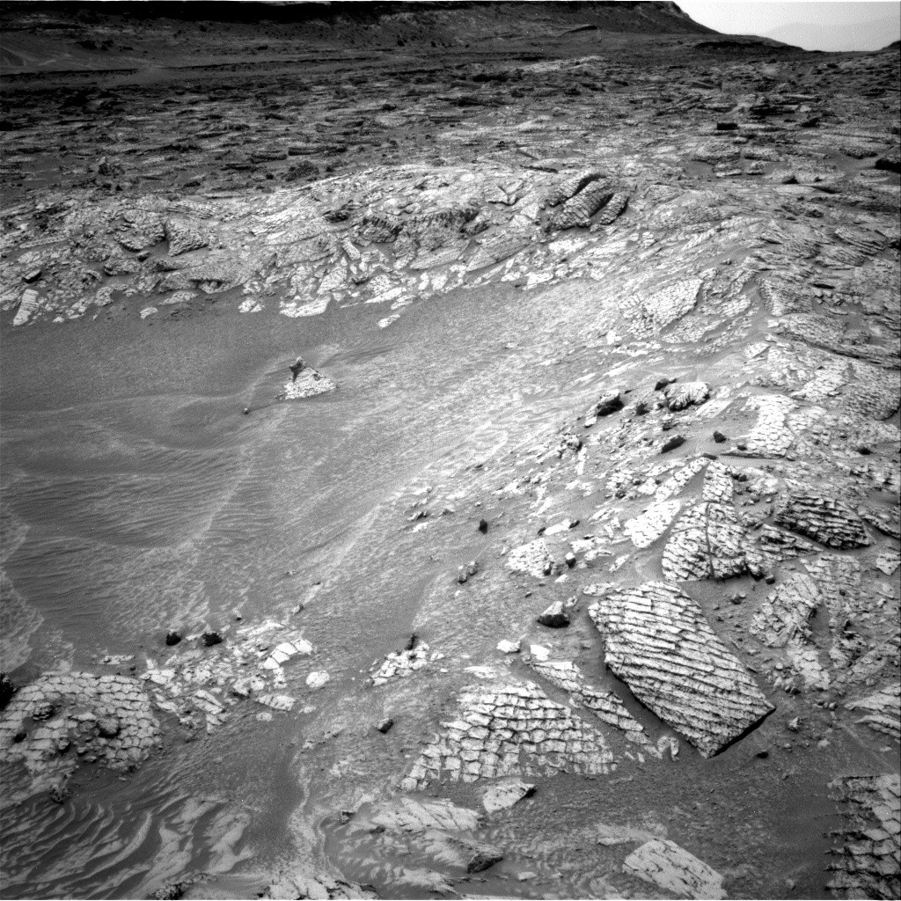

# Curiosity Rover Sols 4867-4872: Exploring Antofagasta Crater and Selecting Next Drill Target

**Summary:** On April 13, 2026 (Sol 4865), NASA's Curiosity Mars rover arrived at the rim of the Antofagasta crater on Mars. Because the crater bottom was filled with dark rippled sandy material, making drilling too risky, the mission team decided to abandon the crater drilling plan and instead conducted detailed imaging and compositional analysis of polygonal bedrock features on the crater rim to identify safer next drill targets.

*Credit: NASA/JPL-Caltech*

## Mission Background

The Curiosity rover is conducting the Mars Science Laboratory (MSL) mission. This week, it arrived at the rim of the Antofagasta crater (approximately 10 meters / 33 feet in diameter) for planned exploration. The crater appeared fresh and deep with a well-defined rim that didn't show significant erosion—originally raising high hopes that it could reveal deep rock layers.

However, upon arriving at the crater rim, Curiosity found that the crater bottom was covered with dark rippled sandy material that obscured the most interesting rock layers. Even though a few rock exposures were visible just above the sand cover, these rocks appeared to have been exposed to space radiation since their sediments were deposited, and reaching them from the rim would have placed the rover at an awkward angle, making it impossible to safely deliver samples to the instruments.

## Alternative Science Plan

Despite abandoning the drilling plan inside Antofagasta crater, the rover's workspace was rich with interesting bedrock targets, including polygonal features. The mission team developed a detailed observation plan: detailed imaging of the crater and nearby buttes, along with APXS geochemistry, MAHLI close-up imaging, and ChemCam LIBS geochemical compositional analysis.

The analysis focused on polygonal fracture-bearing rocks on the crater rim—key samples that may reveal critical information about Mars' geological history. The team continued to evaluate the possibility of entering the crater bottom's rippled sand fill area but ultimately determined the risk of the rover getting stuck was too high.

## Curiosity Rover Mission Overview

Curiosity landed in Gale Crater on August 6, 2012, and is a major component of NASA's Mars exploration program. The Mars Science Laboratory mission is managed by NASA's Jet Propulsion Laboratory (JPL). Curiosity's scientific instrument suite enables rock compositional analysis, Martian atmospheric measurements, and astrobiology research.

Curiosity's findings continue to deepen humanity's understanding of Mars' geological history and potential habitability, with its drill sample analysis providing critical data for studying ancient Martian environments.

## Sources (original pages)

- [Curiosity Blog, Sols 4867-4872 — NASA Science](https://science.nasa.gov/blog/curiosity-blog-sols-4867-4872-sand-fill-in-antofagasta-crater-and-finding-our-next-drill-target/)
- [Mars Science Laboratory Mission — NASA JPL](https://mars.nasa.gov/msl/)
