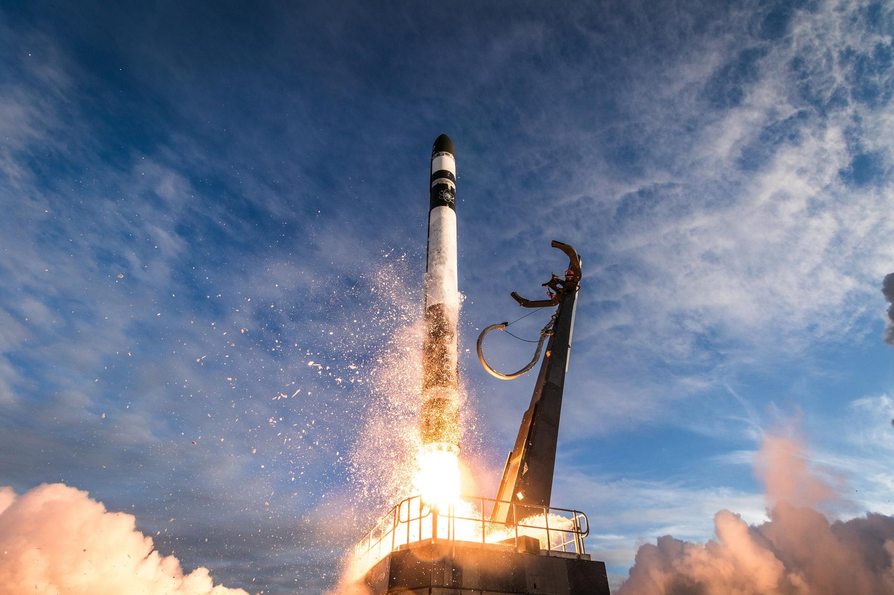

# Rocket Lab HASTE Mission Success: Bubbles Scientific Payload Completes Suborbital Flight

**Summary:** Rocket Lab launched the HASTE (Hypersonic Accelerator Suborbital Test Experiment) mission on April 22, 2026 at 00:00 UTC (08:00 Beijing time) to launch the HASTE (Hypersonic Accelerator Suborbital Test Experiment) mission carrying the Bubbles scientific payload aboard an Electron rocket from Wallops Flight Facility in Virginia, USA. The HASTE program specializes in hypersonic accelerator suborbital testing, providing low-cost, high-frequency suborbital flight opportunities for research institutions and commercial clients.

*Credit: Rocket Lab / TheSpaceDevs*

## HASTE Program Background

HASTE (Hypersonic Accelerator Suborbital Test Experiment) is Rocket Lab's suborbital launch services program, specifically designed for hypersonic research and scientific experiments. Compared to traditional sounding rockets and hypersonic test facilities, HASTE offers lower cost and higher frequency access to suborbital flight, providing longer microgravity experiment time and higher altitude than conventional approaches.

The Bubbles mission designation corresponds to a specific scientific experiment, with further details available through official mission pages. Rocket Lab continues to expand the Electron rocket's mission adaptability—from commercial satellite deployment to suborbital research experiments—demonstrating the flexibility of small launch vehicles in the scientific research launch sector.

## Launch Details

| Item | Details |
|------|---------|
| Rocket | Electron |
| Mission Designation | HASTE / Bubbles |
| Launch Time | 2026-04-22 00:00 UTC |
| Launch Window | 2026-04-22 00:00–23:59 UTC (daily window) |
| Launch Site | Wallops Flight Facility, Virginia, USA |
| Mission Type | Suborbital flight experiment |
| Altitude | Suborbital (~250–300 km) |
| Operator | Rocket Lab |

## Wallops Flight Facility

Wallops Flight Facility, located in Virginia, USA, is a NASA Goddard Space Flight Center launch facility primarily supporting NASA, state agencies, and commercial companies for suborbital and sounding rocket missions. Situated near the Atlantic coast, the facility offers favorable safety and monitoring conditions for various high-altitude balloon and small rocket experiments.

## Rocket Lab Electron Rocket Overview

Electron is a small launch vehicle developed by Rocket Lab, primarily used for delivering small satellites to low Earth orbit (LEO). The rocket's first stage employs nine Rutherford engines, while the second stage uses a single vacuum-optimized Rutherford engine. To date, Electron has conducted multiple flight missions and serves as the primary launch system for Rocket Lab.

HASTE missions utilize a modified Electron configuration with a specialized upper stage or altered flight profile to meet suborbital research flight requirements.

## Sources (Original Articles)

- [HASTE Bubbles Launch Details - TheSpaceDevs](https://ll.thespacedevs.com/2.2.0/launch/)
- [Rocket Lab Updates](https://www.rocketlabusa.com/updates/)
- [Wallops Flight Facility - NASA](https://www.nasa.gov/centers/wallops/home/)

> Note: Launch timing may be adjusted based on actual conditions. This report is preview in nature; actual launch time is subject to Rocket Lab's official announcements.
