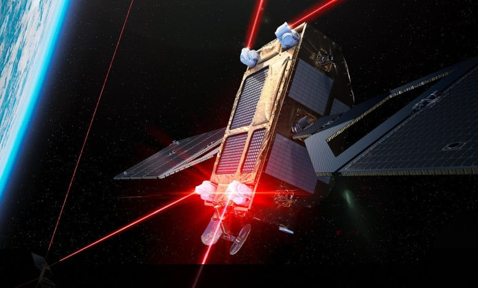

# Rocket Lab HASTE Successfully Launches Hypersonic Test Mission

**Summary:** On April 22, 2026, Rocket Lab launched the second mission under its HASTE (Hypersonic Accelerator Suborbital Test Electron) program from Wallops Flight Facility in Virginia, USA. The mission continues Rocket Lab's exploration of hypersonic technology capabilities.

*Credit: Rocket Lab*

## Mission Overview

HASTE is a commercial suborbital hypersonic test service offered by Rocket Lab to provide rapid and frequent hypersonic technology verification capabilities for customers. This launch represents the second mission under the HASTE program, further validating Rocket Lab's capabilities in suborbital hypersonic testing.

- **Launch Time**: April 22, 2026, 00:00 UTC (approximately 08:00 Beijing time on April 22)
- **Launch Site**: Wallops Flight Facility, Virginia, USA — Rocket Lab Launch Complex 2
- **Vehicle**: Electron
- **Mission Type**: Hypersonic technology suborbital test

## About the HASTE Program

HASTE (Hypersonic Accelerator Suborbital Test Electron) is Rocket Lab's commercial suborbital hypersonic testing service designed to provide customers with rapid, frequent access to hypersonic technology validation. The program received support from the U.S. Department of Defense and represents a significant component of Rocket Lab's expanding space systems business.

## Sources (original pages)

- [Rocket Lab: Mission Success - Rocket Lab Launches 2nd Hypersonic Test Mission](https://www.rocketlabusa.com/updates/mission-success-rocket-lab-launches-2nd-hypersonic-test-mission-in-three-months-for-defense-innovation-unit/)
- [TheSpaceDevs: HASTE | Bubbles Launch Data](https://ll.thespacedevs.com/2.2.0/launch/HASTE-Bubbles/)
