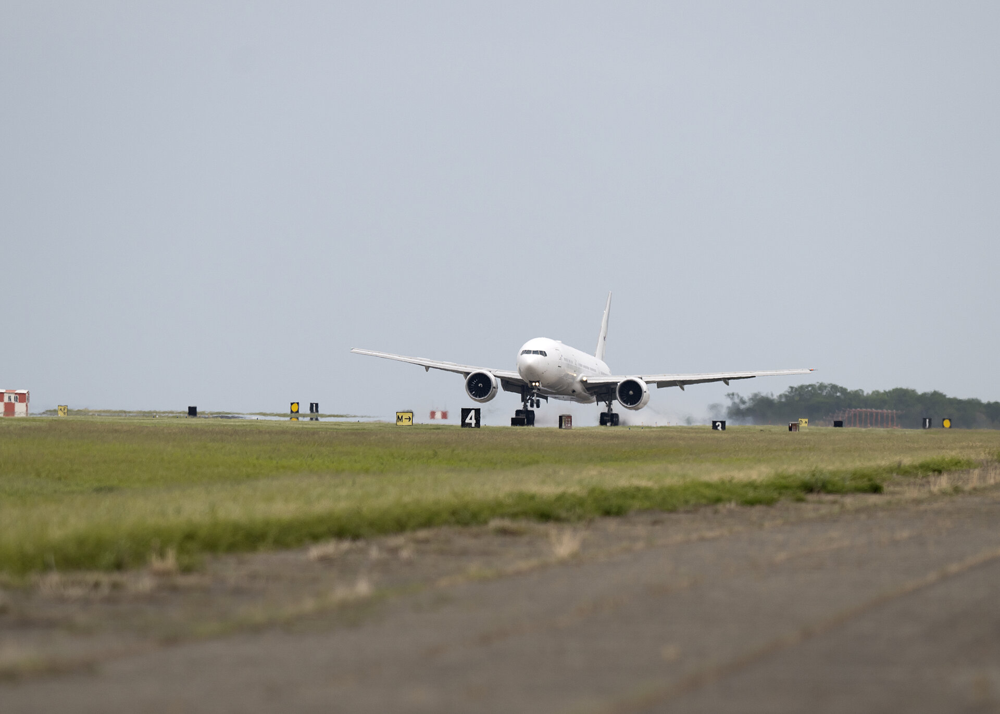

# NASA's Modified Boeing 777 Returns to Fleet as Next-Generation Airborne Science Laboratory

**Summary:** NASA's Boeing 777 has returned to the agency's fleet after undergoing heavy structural modifications that transformed the former giant passenger plane into NASA's next-generation airborne science laboratory. After a check flight and a three-hour transit from Waco, the aircraft returned to NASA's Langley Research Center in Hampton, Virginia on April 22, with science flights on the horizon.

*Credit: NASA*

## Sources (original pages)

- [NASA's Boeing 777 Aircraft Returns Home with Science Flights on the Horizon](https://www.nasa.gov/centers-and-facilities/langley/nasas-777-aircraft-returns-home-with-science-flights-on-the-horizon/)
