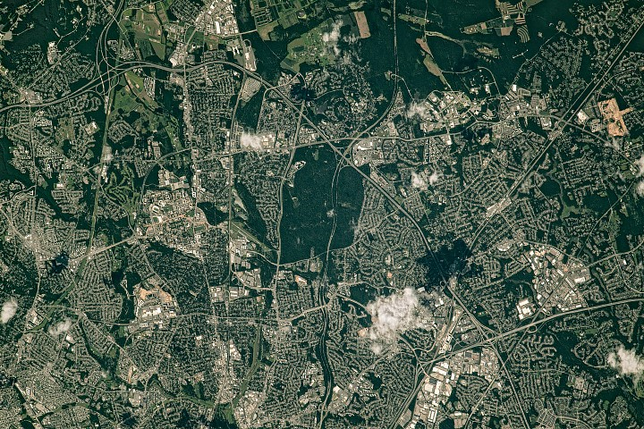

# NASA Earth Observatory Releases Satellite Image of Green Spaces in Washington Suburbs

**Summary:** On April 22, 2026, NASA Earth Observatory published a photograph taken by an astronaut aboard the International Space Station, showing the distribution of green spaces along the northeastern section of the Capital Beltway (I-495) in Maryland. The image clearly depicts the spatial layout of the historic planned community of Greenbelt, NASA's Goddard Space Flight Center, and surrounding agricultural research land.

*Credit: NASA Earth Observatory (Public Domain)*

## Image Overview

The image was captured by an ISS astronaut on July 30, 2023, during the summer when vegetation in the region is lush and green. The coverage area encompasses the northeastern section of the Capital Beltway near Greenbelt, Maryland—an area of significant importance in American planned community history.

One of the most prominent green spaces in the image is Greenbelt Park, covering nearly 5 square kilometers (2 square miles) and containing forested hiking trails, several picnic areas, and a campground. The land was originally intended as a future extension of the City of Greenbelt but was acquired by the National Park Service in 1950.

## Greenbelt: A New Deal Planned Community Legacy

The historic district of Greenbelt is laid out in a distinctive crescent shape. It is one of three planned communities that arose in the 1930s as part of the New Deal program, intended to provide work for the unemployed and to create affordable cooperative housing with accessible green space. Homes connect to walking paths, which in turn connect to one of the country's oldest planned shopping centers.

East of the Beltway lies NASA's Goddard Space Flight Center, established in Greenbelt on May 1, 1959, as NASA's first spaceflight complex. Several patches of forested land separate some of the buildings.

North of Goddard, the large green spaces include forested land and agricultural fields in the town of Beltsville, which house the University of Maryland and USDA agricultural research sites.

## Sources (original pages)

- [Belts of Green in the Washington Suburbs — NASA Earth Observatory](https://science.nasa.gov/earth/earth-observatory/belts-of-green-in-the-washington-suburbs/)
- [NASA Earth Observatory Images of the Day](https://science.nasa.gov/earth/earth-observatory/)

> All NASA Earth Observatory images are published as public domain and freely available for public use.
