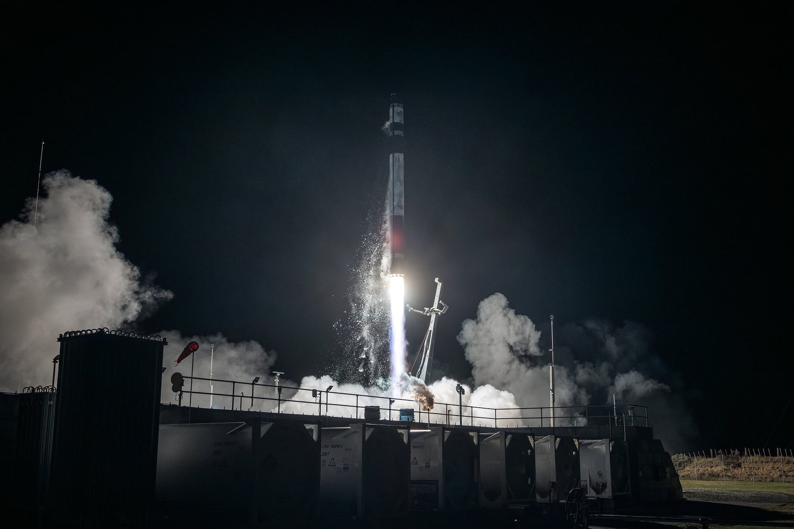

# Rocket Lab 85th Mission Successfully Deploys JAXA Rideshare Satellites

**Summary:** On April 23, 2026, Rocket Lab successfully executed its 85th Electron launch mission from Launch Complex 1 in Mahia Peninsula, New Zealand. Codenamed "Kakushin Rising," the mission carried 8 Japanese satellites including educational small satellites, an ocean monitoring satellite, and a multispectral camera demonstration satellite.

*Credit: Rocket Lab*

## Mission Overview

This mission was Rocket Lab's 85th Electron launch and its second dedicated launch for the Japan Aerospace Exploration Agency (JAXA). The codename "Kakushin Rising" reflects the innovative spirit of Japanese space technology.

- **Launch Time**: April 23, 2026, 03:09 UTC (approximately 11:09 Beijing time on April 23)
- **Launch Site**: Mahia Peninsula, New Zealand — Rocket Lab Launch Complex 1A
- **Vehicle**: Electron
- **Mission Designation**: Kakushin Rising (JAXA Rideshare)

## Payload Details

This launch carried 8 Japanese satellites originally planned to launch on Japan's Epsilon-S rocket, but were delayed due to Epsilon-S test firing failures:

| Satellite | Type | Description |
|-----------|------|-------------|
| MAGNARO-II | Educational | Multi-compartment satellite platform |
| KOSEN-2R | Educational | High school/university collaborative project |
| WASEDA-SAT-ZERO-II | Educational | Waseda University student satellite |
| FSI-SAT2 | Technology Demo | Multispectral camera demonstration |
| OrigamiSat-2 | Technology Demo | Origami-style deployable antenna, expands to 25x compressed size |
| Mono-Nikko | Ocean Monitoring | Marine environment monitoring |
| ARICA-2 | Technology | To be confirmed |
| PRELUDE | Technology | To be confirmed |

OrigamiSat-2 features origami folding technology, with its deployed area 25 times larger than when compressed, demonstrating advanced miniaturization and deployment techniques.

## Sources (original pages)

- [Rocket Lab: Rocket Lab Successfully Launches 85th Mission](https://www.rocketlabusa.com/updates/rocket-lab-successfully-launches-85th-mission-and-first-dedicated-launch-for-european-space-agency/)
- [TheSpaceDevs: Electron | Kakushin Rising Launch Data](https://ll.thespacedevs.com/2.2.0/launch/Electron-Kakushin-Rising-JAXA-Rideshare/)
