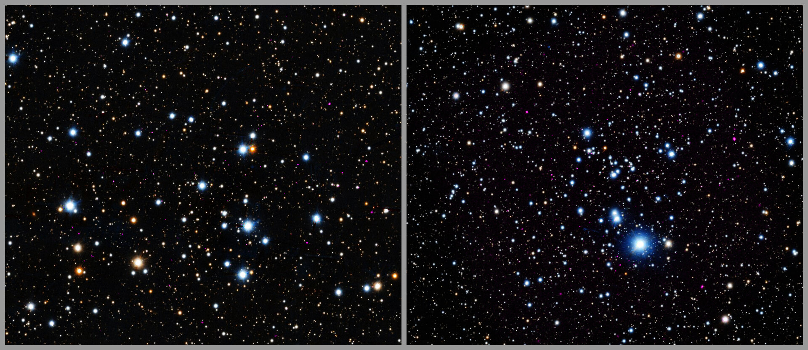

# NASA's Chandra Finds Young Sun-like Stars Dim Quickly in X-rays

**Summary:** A new study using NASA's Chandra X-ray Observatory has found that young Sun-like stars emit significantly less X-ray radiation than previously expected—only about a quarter to a third of predicted levels. The research, examining eight star clusters aged between 45 million and 750 million years old, suggests that the high-energy environment around young planetary systems may be less harsh than models predicted, potentially benefiting the development of conditions favorable to life on exoplanets.

*Credit: NASA*

The study examined eight clusters of stars with ages ranging from 45 million to 750 million years old—relatively young in stellar terms. The researchers found that Sun-like stars in these clusters exhibited X-ray emission levels far below what standard models predicted. This "quieting" of young stars has significant implications for our understanding of the radiation environment around planetary systems during their formative years.

## Implications for Exoplanet Habitability

The reduced X-ray output of young stars is potentially good news for the prospects of life developing on planets within their habitable zones. High-energy X-ray radiation can strip away planetary atmospheres and damage or destroy the complex organic molecules necessary for life as we know it. If young stars emit less of this harmful radiation than expected, planets forming in their orbit may have a better chance of developing and maintaining conditions suitable for life.

The research demonstrates how observatories like Chandra continue to provide crucial insights into fundamental stellar processes, reshaping our understanding of the environments that give rise to planetary systems capable of supporting life.

## Sources (original pages)

- [NASA's Chandra Finds Young Stars Dim Quickly](https://www.nasa.gov/image-article/nasas-chandra-finds-young-stars-dim-quickly/)
