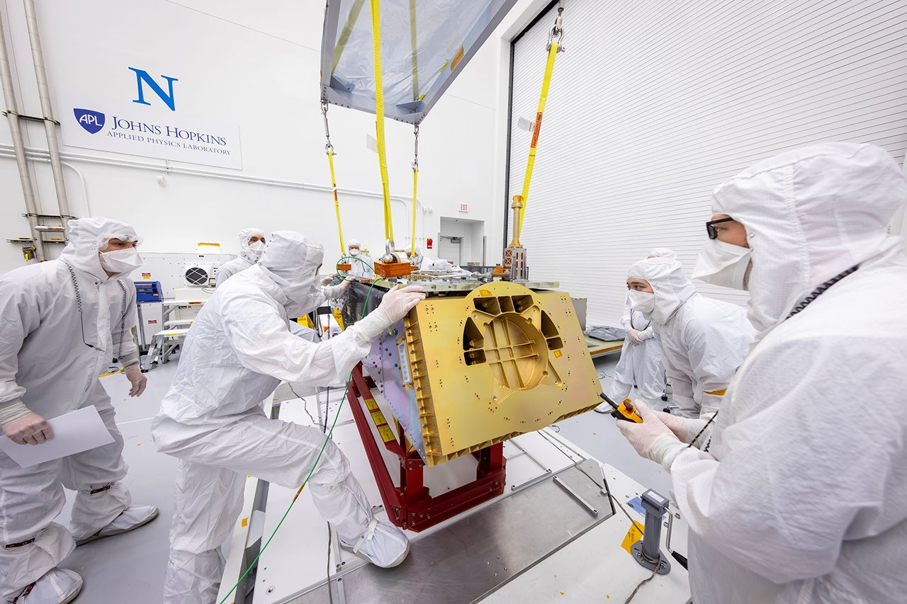

# NASA's Dragonfly Rotorcraft Enters Final Assembly and Testing Phase

**Summary:** NASA's Dragonfly mission to Saturn's largest moon Titan is entering its final assembly and testing phase — the team has begun installing the panels that make up the rotorcraft lander's body. These ultra-lightweight honeycomb panels were designed at the Johns Hopkins Applied Physics Laboratory (APL) and manufactured by Lockheed Martin. Dragonfly will be the first time NASA flies a multi-rotor vehicle for science on another planet, planned for launch no earlier than 2027 and expected to arrive at Titan in 2034.

*Credit: NASA / Johns Hopkins APL*

NASA's Dragonfly rotorcraft is beginning to take shape — literally — with the delivery and installation of the panels that make up the rotorcraft lander's body. These ultra-lightweight honeycomb panels were designed at the Johns Hopkins Applied Physics Laboratory (APL) in Laurel, Maryland, and manufactured by Lockheed Martin. APL manages the Dragonfly mission for NASA.

Dragonfly will be the first time NASA flies a multi-rotor vehicle for science on another planet. The eight-rotor aircraft will explore dozens of locations across Saturn's moon Titan, taking advantage of Titan's dense atmosphere and low gravity to sample and measure the compositions of diverse sites.

Titan is the largest moon of Saturn and the second-largest moon in the solar system. It is the only moon in our solar system with a dense atmosphere and liquid bodies on its surface, making it a unique target for studying the building blocks of life.

Dragonfly will first land at Titan's equatorial "Shangri-La" dune fields — similar in terrain to the linear dunes in Namibia in southern Africa — offering diverse sampling locations. The rotorcraft will then make multiple flights of up to 8 kilometers, stopping along the way to sample compelling areas with diverse geography.

The mission is planned for launch no earlier than 2027, using a high-energy launch option, with an expected arrival at Titan in 2034. NASA has not yet selected the launch vehicle for Dragonfly but will announce the selection once made.

## Sources (original pages)

- [NASA's Dragonfly Rotorcraft Gets Decked Out, Tested (NASA Science)](https://science.nasa.gov/blogs/dragonfly/2026/04/23/nasas-dragonfly-rotorcraft-gets-decked-out-tested/)
