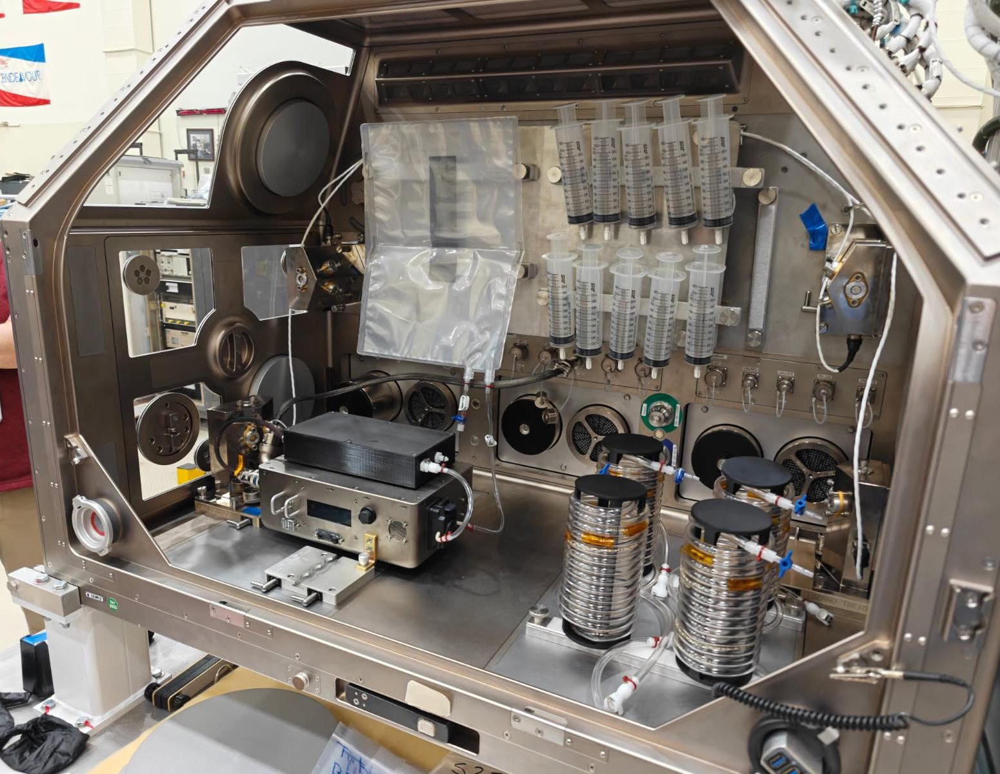

# NASA Develops Space IV Fluid Technology for Deep Space Missions

**Summary:** NASA is developing technology to produce intravenous (IV) fluids in the space environment to support crew health during long-duration deep space missions potentially lasting up to three years. Current IV fluids cannot be stored for extended missions, and this new technology will ensure astronauts on beyond-LEO missions have access to necessary medical care.

*Credit: NASA*

## Sources (original pages)

- [Liquid Lifeline: NASA Tech Could Create IV Fluid In Space](https://www.nasa.gov/general/iv-fluid-in-space/)
