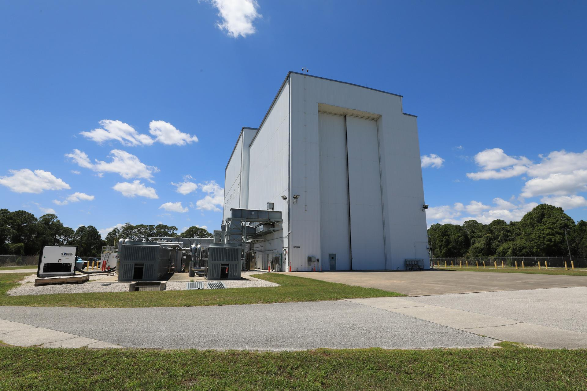

# NASA Kennedy Prepares Facility for Roman Space Telescope Arrival

**Summary:** NASA is preparing facilities at Kennedy Space Center for the arrival of the Nancy Grace Roman Space Telescope, scheduled to launch as early as September this year on a SpaceX Falcon Heavy rocket. Preparations for the launch facilities are currently underway.

*Credit: NASA*

## Sources (original pages)

- [NASA Kennedy Prepares Facility for Roman Space Telescope Arrival](https://www.nasa.gov/centers-and-facilities/kennedy/nasa-kennedy-prepares-facility-for-roman-space-telescope-arrival/)
