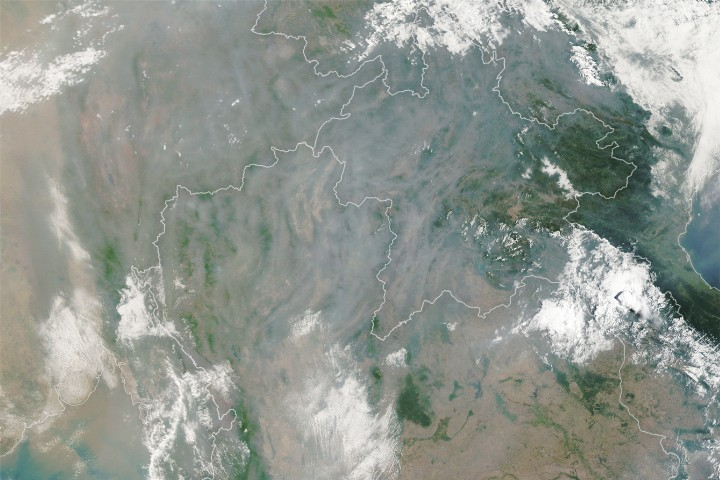

# NASA Earth Observatory: Seasonal Fires Shroud Northern Thailand

**Summary:** NASA's Earth observation satellite captured smoke from seasonal fires shrouding northern Thailand and Southeast Asia, with severe air quality impacts across the region.

*Credit: NASA*

NASA's Terra satellite captured imagery on April 22, 2026 showing dense smoke from seasonal fires blanketing northern Thailand, severely impacting local air quality.

Every spring, seasonal fires sweep across Southeast Asia, primarily driven by agricultural burning and forest fires. The smoke from these fires creates widespread haze affecting not only Thailand but also neighboring countries and regions.

NASA's Earth observation satellites continuously monitor global environmental changes, providing crucial data for climate research and air quality forecasting. This image was captured by the Moderate Resolution Imaging Spectroradiometer (MODIS) aboard NASA's Terra satellite.

## Sources (original pages)

- [Smoke Shrouds Northern Thailand - NASA Earth Observatory](https://science.nasa.gov/earth/earth-observatory/smoke-shrouds-northern-thailand/)
