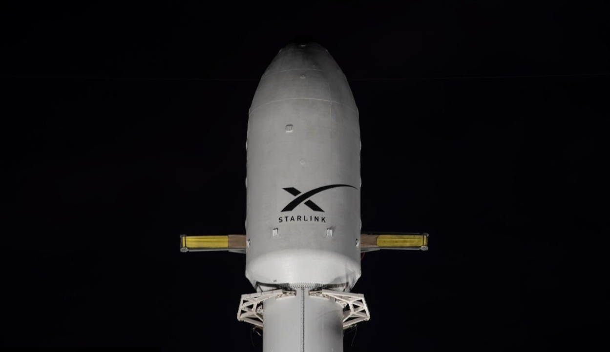

# SpaceX Launches Starlink Group 17-14 Mission

**Summary:** On April 23, 2026 at 02:00 UTC, SpaceX successfully launched the Starlink Group 17-14 mission with 20 satellites from Vandenberg Space Force Base, California, aboard a Falcon 9 Block 5 rocket. The satellites were deployed to their target orbit and the mission was a complete success.

*Credit: SpaceX / TheSpaceDevs*

The Starlink Group 17-14 mission represents another routine deployment in SpaceX's ongoing effort to provide global high-speed internet coverage through its large constellation of low-Earth orbit satellites. This launch used a flight-proven Falcon 9 first stage booster, which was successfully recovered for future reuse.

## Mission Profile

- **Vehicle**: Falcon 9 Block 5
- **Payload**: 20 Starlink satellites (Group 17-14)
- **Launch Site**: Vandenberg Space Force Base, California, USA
- **Launch Time**: April 23, 2026 UTC 02:00
- **Orbit Type**: Low Earth Orbit (LEO)
- **Mission Result**: Success — satellites deployed to target orbit

## Background

SpaceX's Starlink project aims to provide high-speed, low-latency broadband internet access globally through its large constellation of LEO satellites. To date, SpaceX has successfully launched thousands of Starlink satellites, making it the world's largest satellite internet operator.

## Sources (original pages)

- [TheSpaceDevs Launch Database - Starlink Group 17-14](https://ll.thespacedevs.com/2.2.0/launch/)
- [SpaceX Official Website](https://www.spacex.com/)
