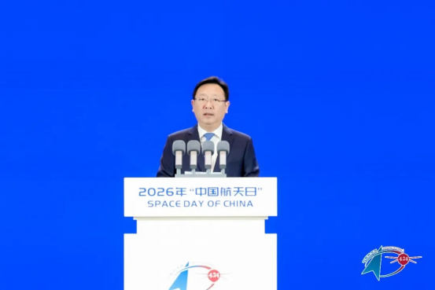

# 11th China Space Day: 70 Years of Journey to the Stars

**Summary:** April 24, 2026 marks the 11th China Space Day, coinciding with the 70th anniversary of China's space industry and the 10th anniversary of the Space Day designation. The opening ceremony in Chengdu, Sichuan released multiple major announcements: Tianwen-3 Mars sample return officially announced (launch ~2028, return ~2031), Chang'e-7 to launch this year, Beidou Navigation System to improve accuracy and user experience, and steady progress on next-gen crewed spacecraft and crewed lunar exploration.

*Credit: CNSA*

## Main Venue Overview

The 2026 China Space Day main venue events were held at the Chengdu Century City International Exhibition Center, co-hosted by the Ministry of Industry and Information Technology, CNSA, and the People's Government of Sichuan Province, with the People's Government of Chengdu and Sichuan University as co-organizers. Brazil served as the guest of honor.

The main venue featured the opening ceremony, space science popularization exhibition series, and a space culture and art forum, alongside the China Space Conference, space science outreach into schools, and technical exchange events.

The opening ceremony unveiled theme promotional videos and a theme song, announced the 2026 "China Space Day Public Welfare Image Ambassador," presented the 2025 Qianshu Fund Highest Achievement Award, Outstanding Contribution Award, and Innovation Team Award, and released a series of major updates on deep space exploration, commercial space, and Chang'e-5 lunar sample research.

## Major Announcements from the Opening Ceremony

### Tianwen-3: Mars Sample Return Mission Officially Unveiled

CNSA officially released the Tianwen-3 mission plan: launch targeted for around 2028, with return of Mars samples to Earth around 2031. Tianwen-3 is a core component of China's planetary exploration program. The spacecraft consists of a lander, ascender, server/orbiter combination, and an orbiter/return vehicle combination, carrying a total of 6 scientific payloads.

CNSA also released the Tianwen-3 Mars Sample Return Mission International Cooperation Opportunity Announcement, offering 20 kg of payload mass for international partners. Five international cooperation projects have been selected, including payloads from Macau University of Science and Technology, The Chinese University of Hong Kong, The University of Hong Kong, and Italy's National Institute for Nuclear Physics.

See our detailed coverage: [Tianwen-3 Mars Sample Return: Launch Planned for ~2028](/en/space-news/2026/04/2026-04-24-tianwen-3-mars-sample-return/)

### Chang'e-7: To Launch This Year

Chang'e-7 is planned for launch this year, conducting surveys of shadow craters at the lunar south pole to search for water ice and other resources, laying the foundation for future lunar resource development.

### Beidou Navigation System: Accuracy and Experience Upgrades

The Beidou Navigation System continues stable and reliable in-orbit service, and will further improve positioning accuracy and optimize user experience while advancing large-scale Beidou applications.

### Next-Gen Crewed Spacecraft and Crewed Lunar Exploration: Steady Progress

China's next-generation crewed spacecraft and crewed lunar exploration programs are progressing smoothly, laying the foundation for future crewed deep space exploration.

## 70 Years of China's Space Industry: From Humble Beginnings to Thriving Development

2026 marks the 70th anniversary of China's space industry. Over seven decades, China's space program has grown from humble beginnings to a thriving powerhouse, achieving a magnificent transformation from nothing to something, from weak to strong. Today, Chinese astronauts are permanently stationed in space, the China Space Station operates routinely, and deep space exploration continues achieving new breakthroughs.

## Space Science Exhibition and Public Activities

From April 24 to May 5, the space science popularization exhibition is open to the public at the Chengdu Century City International Exhibition Center, showcasing space technology, space science, space applications, commercial space, and Sichuan's space industry achievements through models and physical exhibits.

During China Space Day, more than 30 provinces, municipalities, and autonomous regions across the country are hosting space open days, science lectures, knowledge competitions, and exchange seminars. A number of space academicians and experts will visit schools to deliver space science lectures to students of all ages.

## Sources (original pages)

- [2026 China Space Day Main Event to Be Held in Chengdu, Sichuan](https://www.cnsa.gov.cn/n6758823/n6758838/c10739797/content.html) (CNSA)
- [Tianwen-3 Mission Planned to Carry Mars Samples Back to Earth Around 2031](https://www.yangtse.com/news/kj/202604/t20260424_345485.html) (Xinhua)
- [11th China Space Day Main Event Opens in Chengdu](https://new.qq.com/rain/a/20260424A029DY00) (Sichuan Daily)
- [70th Anniversary of China Space Industry, Latest Updates on Beidou and Next-Gen Crewed Spacecraft](https://so.html5.qq.com/page/real/search_news?docid=70000021_42269eabed847452) (CCTV News / IT Home)

> April 24, 2026 marks the 11th China Space Day and the 70th anniversary of China's space industry.
