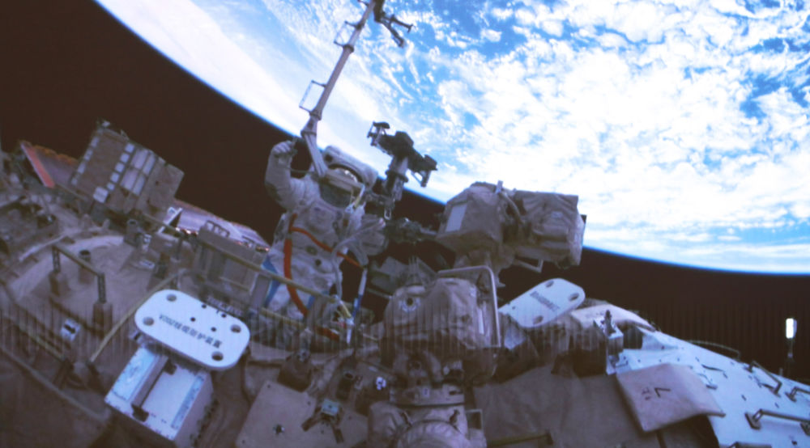

# China's Space Program: 70 Years of Historic Achievements and the Path to Becoming a Space Power

**Summary:** April 24 marks the 11th China Space Day, coinciding with the 70th anniversary of China's space endeavors. Over seven decades, China has achieved historic leaps—from the "Two Bombs, One Satellite" project to crewed spaceflight, from lunar exploration to Mars sample return. The Shenzhou-21 crew has set new records for individual extravehicular activities (EVAs); the emergency launch capability was demonstrated in just 16 days; and China's space station operates routinely, continuously producing scientific results.

*Credit: Xinhua News Agency / Zhang Fan*

## Tiangong Space Station: Routine Operations and Frequent EVAs

On April 16, 2026, images of Shenzhou-21 crew astronaut Wu Fei performing extravehicular work were captured and released by the Beijing Aerospace Flight Control Center. This is just a glimpse of the Tiangong Space Station's routine operations. With Shenzhou crewed spacecraft launching in succession and astronauts continuously stationed aboard Tiangong, individual EVA records have been repeatedly broken. China's crewed spaceflight program has conducted 16 crewed missions, with a total of 44 person-times entering space.

The Tiangong Space Station, now in its application and development phase, has become a national space laboratory, conducting space science experiments, technology demonstrations, and space applications onboard.

## 16 Days: The "China Speed" of Emergency Space Launch

On November 25, 2025, the Long March-2F YZ-22 rocket carrying the Shenzhou-22 spacecraft ignited at the Jiuquan Satellite Launch Center. The Shenzhou-22 spacecraft separated successfully from the Long March rocket and entered its predetermined orbit, and the launch mission was a complete success.

What makes this remarkable is that it was an "emergency launch"—in the face of an urgent situation in space, the crewed spaceflight engineering team responded rapidly, completing the entire process from decision to launch in just **16 days**, and the astronaut crew returned safely. This "16-day emergency launch" fully demonstrates China Space's rapid response capability and technical strength when facing contingencies.

## The Spirit That Drives China Space Forward

The "Two Bombs, One Satellite" spirit, the crewed spaceflight spirit, the lunar exploration spirit, and the new-era Beidou spirit—cast by generations of Chinese spaceworkers—have become an inexhaustible source of motivation for Chinese people exploring the cosmos.

In 2026, China's space industry celebrates its 70th anniversary. Chinese astronauts are always present in space, the Tiangong Space Station operates routinely; Chang'e-6 achieved humanity's first lunar far-side landing and sample return; the Tianwen-1 Mars exploration mission was a complete success; and the Beidou Navigation System serves the world. China is steadily advancing from a space power to a space powerhouse.

## Looking Ahead: Commercial Space and Deep Space Exploration

In 2026—the opening year of the "15th Five-Year Plan"—commercial space has been designated a national emerging pillar industry and is expected to become a trillion-yuan engine driving economic development. At the same time, the Chang'e lunar exploration program Phase IV advances steadily, the Tianwen-3 Mars sample return mission is planned for launch around 2028, with return of Mars samples to Earth around 2031.

Chinese space workers are pressing forward with vigor, chasing dreams among the stars, and advancing towards the goal of building a space powerhouse.

## Sources (original pages)

- [奋楫问天路，逐梦探苍穹 - National Space Administration](https://www.cnsa.gov.cn/n6758823/n6758838/c10743300/content.html)
