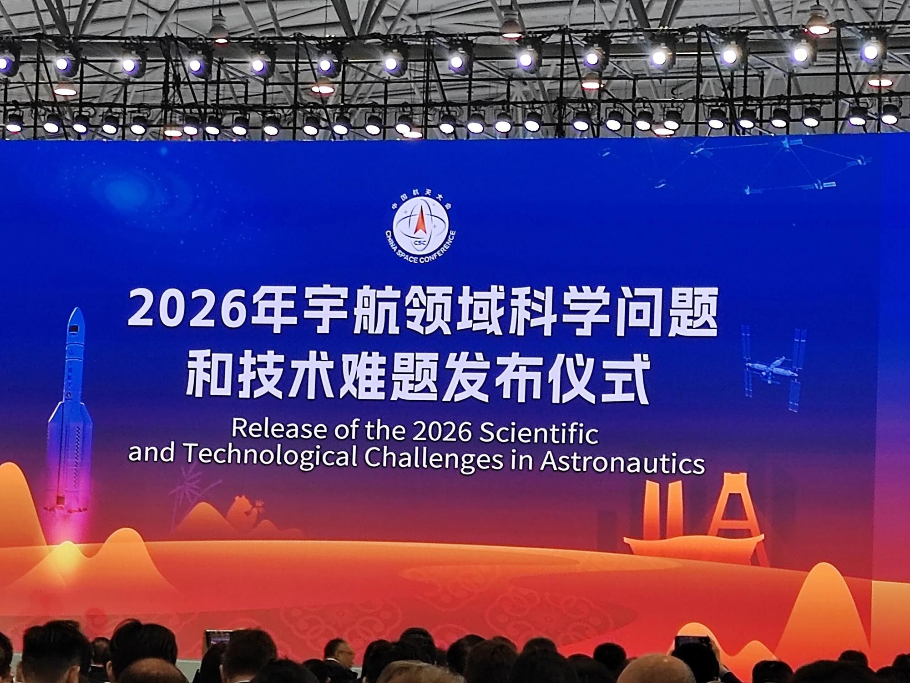
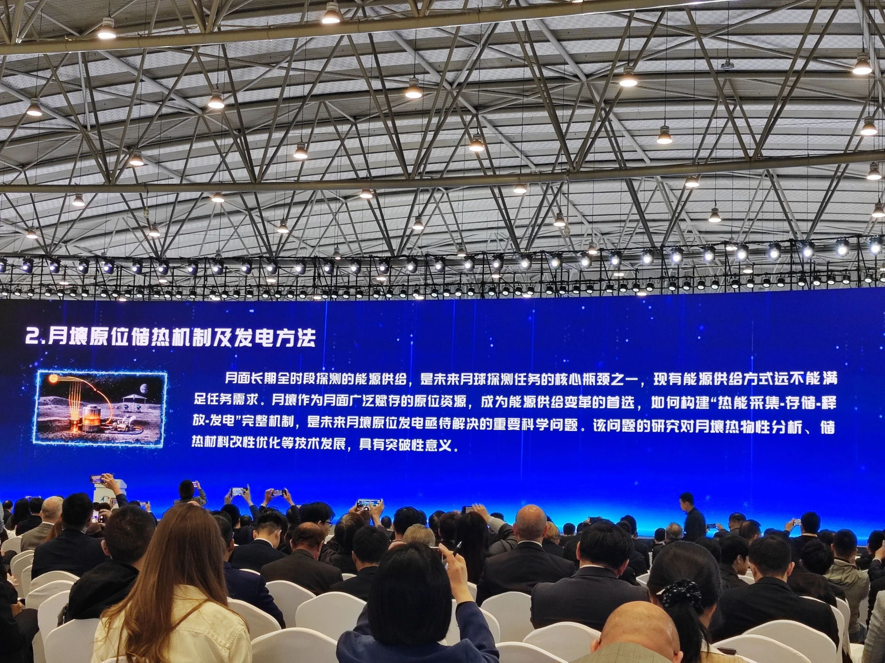
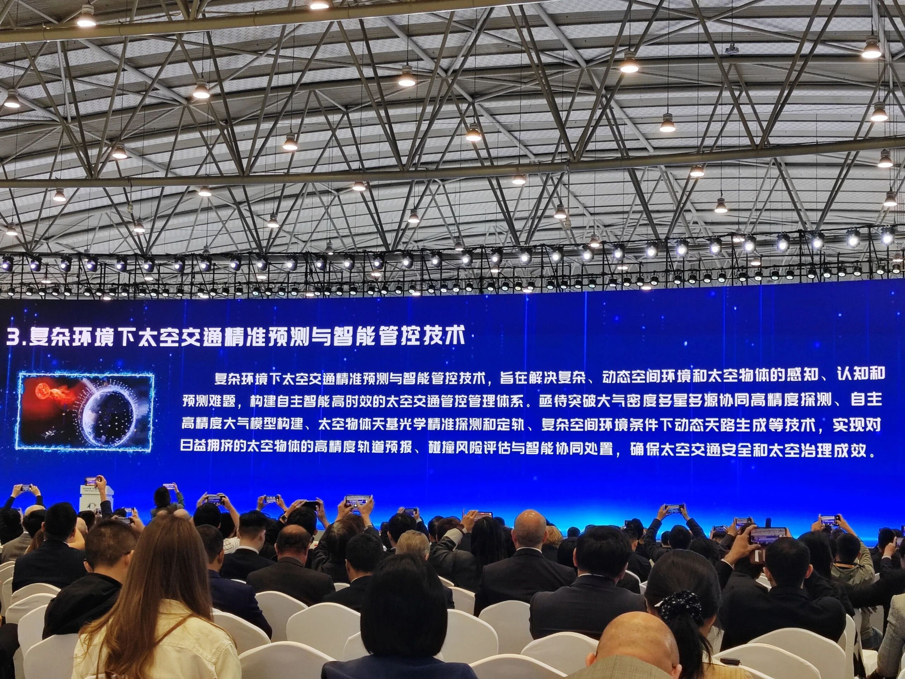
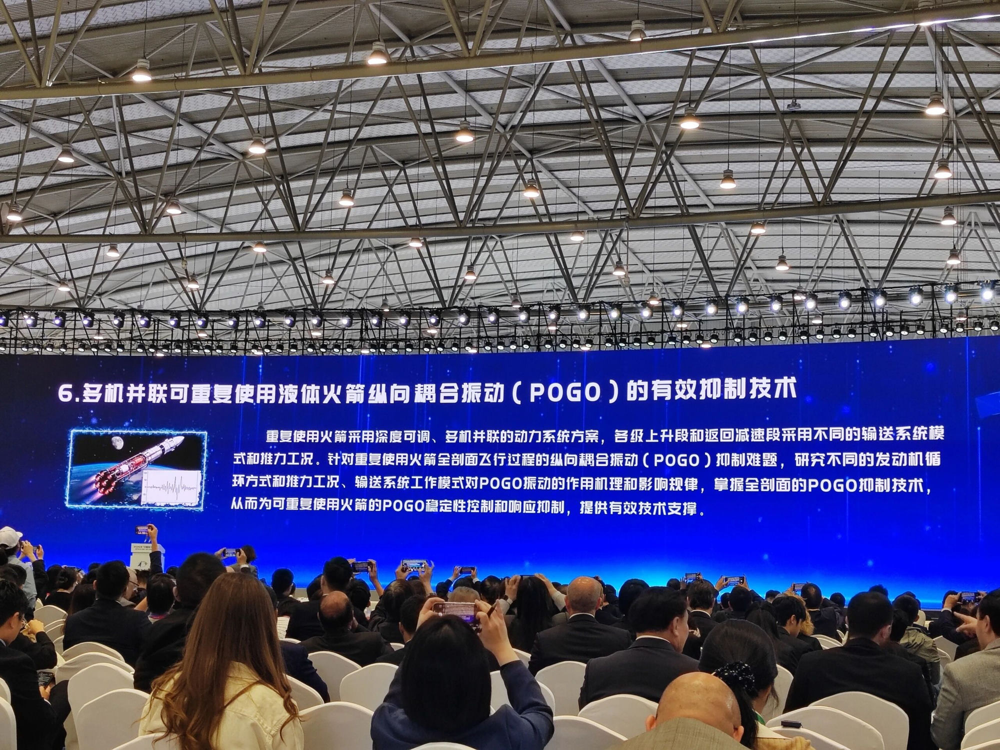
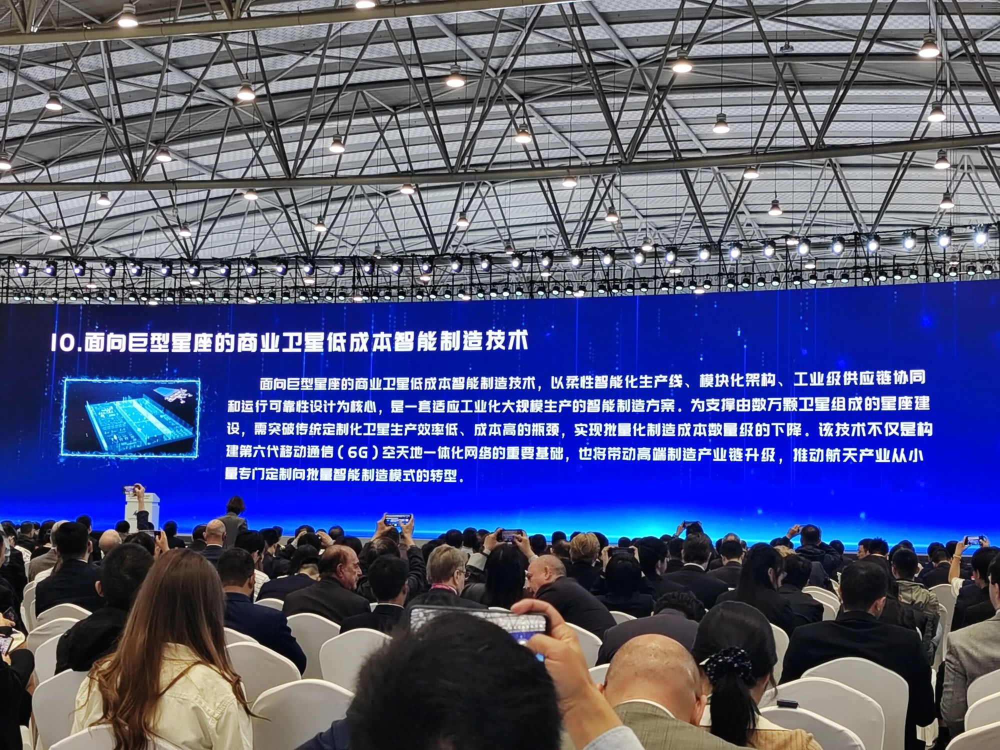

# China Space Conference Releases 2026 Top 10 Scientific and Technological Challenges in Astronautics

**Summary:** On April 23, 2026, the China Space Conference (CSC2026) held the "Release of the 2026 Scientific and Technological Challenges in Astronautics" ceremony in Chengdu, unveiling the annual top 10 challenges. These span cislunar spatiotemporal reference frames, lunar regolith in-situ power generation, space traffic management, LEO megaconstellations, extraterrestrial robots, POGO suppression, nuclear thermal propulsion, cryogenic VLWIR hyperspectral imaging, space-based ocean profile observation, and low-cost satellite manufacturing.

*Credit: Chinese Society of Astronautics / China Space Conference 2026*

## Sources

- [2026 China Space Conference Official Agenda - Chinese Society of Astronautics](https://www.spaceflightfans.cn/news/2026_csc2026_agenda)

> On April 23, 2026, the China Space Conference released the 2026 top 10 scientific and technological challenges in astronautics.

## Background

The annual release of scientific and technological challenges in astronautics began with the inaugural China Space Conference in 2018. Challenges are solicited from across academia and industry, evaluated through multiple rounds of expert review, and officially released at the conference. The initiative aims to identify key scientific and technological bottlenecks constraining China's space development, providing direction for fundamental research and core technology breakthroughs.

The 2026 challenges were officially released on April 23 at CSC2026 in Chengdu, spanning deep space exploration, space infrastructure, launch vehicles, and satellite applications. Three notable trends emerge: **intensified cislunar space focus**, **deep integration of artificial intelligence**, and **a clear orientation toward commercialization and large-scale production**.

---

## 1. Ultra-High Precision Spatiotemporal Reference in Cislunar Space

*Credit: Chinese Society of Astronautics / China Space Conference 2026*

An ultra-high precision spatiotemporal reference in cislunar space is an essential foundation for ensuring the smooth implementation of aerospace activities in that region. Carrying out research on the construction, traceability, and transmission methods of cislunar spatiotemporal references; establishing high-precision ephemeris, dynamics, and gravitational field models for the Earth-Moon system; building an ultra-high precision spatiotemporal reference system framework suitable for cislunar space; and developing China-led spatiotemporal service standards for cislunar space are of great significance for future lunar landing activities, lunar resource development, the construction of the International Lunar Research Station, and the high-precision control of various deep-space spacecraft.

**Keywords:** cislunar space, spatiotemporal reference, ephemeris model, gravitational field model

## 2. In-Situ Thermal Storage Mechanism and Power Generation Methods from Lunar Regolith

*Credit: Chinese Society of Astronautics / China Space Conference 2026*

The energy supply for long-term, full-time lunar surface exploration is one of the core bottlenecks for future lunar missions; existing energy supply methods are far from meeting mission requirements. As an in-situ resource widely available on the lunar surface, lunar regolith has become the primary candidate for energy supply transformation. How to build a complete mechanism of "thermal energy collection—storage—release—power generation" is a critical scientific problem that needs to be solved urgently for future in-situ power generation from lunar regolith. Research on this issue is of breakthrough significance for the development of technologies such as lunar regolith thermophysical property analysis and thermal storage material modification and optimization.

**Keywords:** lunar regolith, in-situ resource utilization (ISRU), thermal storage, power generation, energy supply

## 3. Precise Prediction and Intelligent Management of Space Traffic in Complex Environments

*Credit: Chinese Society of Astronautics / China Space Conference 2026*

This technology aims to solve problems related to perceiving, understanding, and predicting the behavior of space objects within complex, dynamic environments, and to build an autonomous, intelligent, and efficient space traffic management system. Key technical breakthroughs needed include multi-satellite collaborative high-precision atmospheric density detection, autonomous high-precision atmospheric model construction, space-based optical precision detection and orbit determination for space objects, and dynamic "space route" generation in complex environments. The ultimate objective is to achieve high-precision orbital forecasting for increasingly congested orbits, collision risk assessment, and intelligent coordinated response, ensuring space traffic safety and effective space governance.

**Keywords:** space traffic management (STM), collision risk assessment, space-based optical detection, atmospheric density model

## 4. Optimal Design and Intelligent Operation of Large-Scale LEO Constellations

*Credit: Chinese Society of Astronautics / China Space Conference 2026*

This technology aims to overcome the bottlenecks of efficient management and autonomous operation of constellation systems in dynamic, complex space environments, building a next-generation intelligent constellation operations system centered on artificial intelligence. Through breakthroughs in constellation configuration optimization, autonomous cooperative collision avoidance within constellations, autonomous health management, and autonomous mission management, it aims to achieve a revolutionary shift toward on-board intelligence for constellation systems, driving the evolution of space assets toward new operational paradigms. This is of great significance for enhancing China's autonomous operation capabilities for large-scale space assets and ensuring the safe and reliable operation of space systems.

**Keywords:** LEO constellation, artificial intelligence, autonomous collision avoidance, health management, constellation operations

## 5. Intelligent Autonomous Exploration and Operation Technology for Extraterrestrial Space Robots

*Credit: Chinese Society of Astronautics / China Space Conference 2026*

This technology refers to a technical system in which robots, operating in extraterrestrial environments, efficiently and autonomously complete exploration and operation tasks through the integrated intelligent collaboration of perception, decision-making, and control. Deeply empowered by artificial intelligence, robots can achieve environmental adaptation, autonomous task decision-making, and collaborative self-organization, serving as core equipment to support the transfer and assembly of extraterrestrial equipment, in-situ resource utilization, and research station construction. Research on this challenge can provide technical support for major projects such as lunar research stations and Mars bases, contributing to the development of new quality productive forces.

**Keywords:** extraterrestrial robots, artificial intelligence, autonomous exploration, in-situ resource utilization (ISRU)

## 6. Effective Suppression of POGO Vibration in Multi-Engine Parallel Reusable Liquid Rockets

*Credit: Chinese Society of Astronautics / China Space Conference 2026*

Reusable rockets employ deeply throttleable, multi-engine parallel propulsion system architectures, with different stages operating in different engine cycles and thrust conditions during ascent and return deceleration phases. To address the challenge of POGO (longitudinal coupled vibration) suppression across the full flight profile of reusable rockets, research is needed on the mechanisms and influence patterns of different engine cycles, thrust conditions, and propellant feed system modes on POGO vibration, in order to master full-profile POGO suppression technology, thereby providing effective technical support for POGO stability control and response suppression in reusable rockets.

**Keywords:** POGO vibration, longitudinal coupled vibration, reusable rocket, multi-engine parallel

## 7. Extremely High Specific Impulse Nuclear Thermal Propulsion Based on Liquid Core

*Credit: Chinese Society of Astronautics / China Space Conference 2026*

Liquid-core nuclear thermal propulsion systems use liquid uranium as fuel, with centrifugal force generated by high-speed rotation constraining the liquid fuel within the reactor. This allows the propellant to directly exchange heat with the ultra-high-temperature liquid fuel, thereby achieving energy utilization efficiency and exhaust temperatures far exceeding those of solid-core nuclear thermal propulsion systems. The specific impulse is expected to reach more than four times that of conventional chemical propulsion. Breakthroughs in this technology are of great significance for supporting crewed deep-space exploration, enabling rapid deep-space transportation, and significantly shortening mission durations.

**Keywords:** nuclear thermal propulsion (NTP), liquid core, high specific impulse, deep space exploration

## 8. Deep Cryogenic Very Long Wave Infrared Hyperspectral Imaging Technology

*Credit: Chinese Society of Astronautics / China Space Conference 2026*

The longer the wavelength, the weaker the signal radiated by objects, which gradually becomes submerged in detector dark current and the background radiation of the opto-mechanical system. Hyperspectral imaging further divides the infrared band into hundreds of channels, significantly reducing single-channel signal strength. Overcoming key technologies such as "zero" background in opto-mechanical systems, deep cryogenic fine spectroscopy, and ultra-low dark current very long wave infrared detectors to achieve deep cryogenic VLWIR hyperspectral imaging will greatly enhance humanity's ability to perceive Earth's cryosphere and deep-space cold targets, further expanding the boundaries of Earth and universe exploration.

**Keywords:** very long wave infrared (VLWIR), hyperspectral imaging, deep cryogenic, detector dark current

## 9. Space-Based Stereoscopic Observation Technology for Multi-Element Ocean Environment Profiles

*Credit: Chinese Society of Astronautics / China Space Conference 2026*

Currently, space-based ocean remote sensing is largely limited to sea surface observation, lacking the capability for vertical profile detection of subsurface physical, chemical, and ecological elements. Achieving three-dimensional, high-precision, high-timeliness, quantitative observation of subsurface ocean environmental elements is a major challenge facing the space-based ocean remote sensing system. Breaking through cross-medium multi-source ocean profile space-based synchronized fine detection technology, and big-data-based multi-element inversion and fusion model construction methods, will form a new-generation ocean remote sensing stereoscopic observation system, fill the gap in sub-mesoscale profile remote sensing, enable precise ocean environment monitoring, and enhance China's comprehensive underwater detection capabilities in the ocean domain.

**Keywords:** ocean remote sensing, subsurface detection, space-based observation, cross-medium sensing

## 10. Low-Cost Intelligent Manufacturing Technology for Commercial Mega-Constellation Satellites

*Credit: Chinese Society of Astronautics / China Space Conference 2026*

This technology centers on flexible intelligent production lines, modular architecture, industrial-grade supply chain coordination, and operational reliability design, forming an intelligent manufacturing solution adapted for large-scale industrial production. To support the construction of constellations comprising tens of thousands of satellites, the bottleneck of low production efficiency and high cost in traditional customized satellite manufacturing must be overcome, achieving orders-of-magnitude reductions in batch manufacturing costs. This technology is not only a critical foundation for building the 6G integrated space-air-ground network, but will also drive the upgrade of the high-end manufacturing industry chain, promoting the transformation of the space industry from small-batch custom manufacturing to mass intelligent manufacturing.

**Keywords:** megaconstellation, intelligent manufacturing, commercial satellite, modular architecture

---

## Overview

The 2026 top 10 challenges systematically outline the directions for future space technology breakthroughs across three dimensions:

**Cislunar Space and Deep Space Exploration** (Challenges 1, 2, 5, 7): Focusing on cislunar spatiotemporal reference construction, in-situ lunar energy acquisition, autonomous extraterrestrial robots, and nuclear thermal propulsion — foundational and frontier topics that provide technical reserves for lunar research stations and crewed deep-space missions.

**Space Infrastructure and Operations Management** (Challenges 3, 4, 10): Addressing systemic issues of space traffic governance, intelligent constellation operations, and mass satellite manufacturing, responding to the real-world challenges of increasingly congested LEO and large-scale constellation deployment.

**Payload and Sensing Technologies** (Challenges 6, 8, 9): From POGO vibration suppression in rocket propulsion systems to VLWIR hyperspectral imaging and subsurface ocean stereoscopic observation, focusing on enhancing equipment reliability and expanding the depth and breadth of environmental perception.

> Source: China Space Conference 2026 (CSC2026) live release, April 23, 2026, Chengdu.
