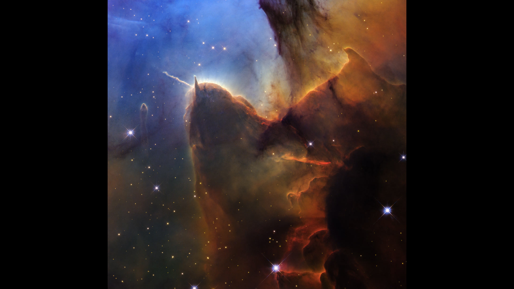

# Hubble Space Telescope Releases New Image of Trifid Nebula, Marking 36th Launch Anniversary

**Summary:** On April 20, 2026, NASA released a high-resolution image of the Trifid Nebula captured by the Hubble Space Telescope, celebrating the 36th anniversary of its launch on April 24. The visible-light image reveals intricate details of this star-formation region about 5,000 light-years from Earth, with colors reminiscent of fine-grained sediments fluttering through ocean depths.

*Credit: NASA, ESA, STScI; Image Processing: Joseph DePasquale (STScI)*

The Trifid Nebula is a star-formation region where several massive stars (outside this field of view) have been shaping the region for at least 300,000 years. Their powerful winds continue to blow an enormous bubble, pushing and compressing the cloud's gas to create new stars. Hubble's visible-light image reveals intricate details within the nebula, including gaseous filaments, dust lanes, and glowing regions surrounding newborn stars.

The image was released on April 24, the 36th anniversary of Hubble's launch in 1990. Hubble is one of the most successful scientific instruments in human history and continues to provide invaluable astronomical observations for scientists worldwide.

## Sources (original pages)

- [The Day of the Trifid Nebula - NASA](https://www.nasa.gov/image-article/the-day-of-the-trifid-nebula/)
