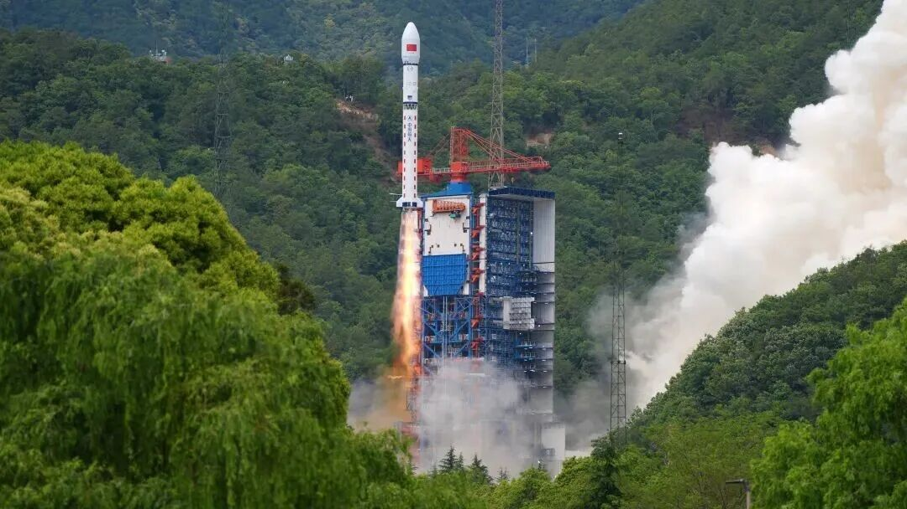

# China Launches Satellite Internet Technology Test Satellites via Long March 2D

**Summary:** On April 24, 2026 at 14:35 BJT, China successfully launched four satellite internet technology test satellites aboard a Long March 2D rocket from Xichang Satellite Launch Center. The satellites will be used to test direct-to-cell satellite broadband and integrated space-ground network technologies, marking an important breakthrough in China's satellite internet construction.

*Image credit: The Paper / Xu Lihao*

On April 24, 2026 at 14:35 Beijing Time, China successfully launched four satellite internet technology test satellites from Xichang Satellite Launch Center using a Long March 2D carrier rocket. The launch was a complete success, with all satellites entering their predetermined orbits.

## Mission Objectives and Technical Verification

The satellite internet technology test satellites were developed by Galaxy Space (Beijing) Technology Group Co., Ltd. They will be primarily used for the following technical verifications:

**Direct-to-Cell Satellite Broadband:** This technology enables ordinary smartphones to directly connect to satellite broadband networks. In the future, users in remote areas, at sea, or in aviation scenarios where ground base stations are unavailable could directly access high-speed broadband via their mobile phones without additional equipment.

**Integrated Space-Ground Network:** This constructs an integrated architecture connecting ground communication networks with satellite communication networks, enabling seamless switching between the two types of networks. It represents a key technology for future 6G space-ground integrated networks.

The successful launch marks an important breakthrough for China in direct-to-cell satellite broadband technology, laying a solid foundation for subsequent satellite internet construction and commercial services.

## Mission Summary

| Item | Details |
|------|---------|
| Launch Vehicle | Long March 2D (LM-2D) |
| Launch Site | Xichang Satellite Launch Center |
| Launch Time | April 24, 2026 14:35 BJT |
| Payload Configuration | Four satellites in one launch |
| Satellite Purpose | Direct-to-cell broadband, space-ground network integration testing |
| Manufacturer | Galaxy Space (Beijing) Technology Group |
| Mission Significance | Key technical verification for satellite internet construction |

The Long March 2D rocket is developed by the Eighth Academy of China Aerospace Science and Technology Corporation. It is a conventional two-stage liquid launch vehicle with the capability to launch single or multiple satellites to different orbital requirements, with a payload capacity of 1.9 tons to a 500 km Sun-synchronous orbit. This launch was the 104th flight of the Long March 2D rocket and the 639th flight of the Long March series.

## Sources (original pages)

- [China successfully launches satellite internet technology test satellites (The Paper)](https://m.thepaper.cn/newsDetail_forward_33046068)
- [Long March 2D successfully launches four satellites (The Paper)](https://www.thepaper.cn/newsDetail_forward_33046180)
- [China successfully launches satellite internet technology test satellites (Xinhua)](http://www.xinhuanet.com/2026-04/24/content_402323.htm)
