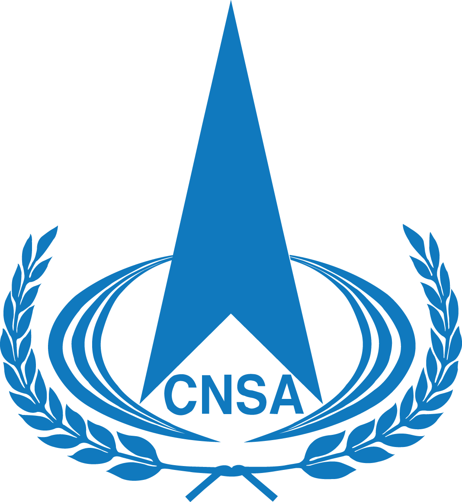

# China Space Public Welfare Ambassador Visits Sichuan University

**Summary:** On April 24, the "China Space Public Welfare Ambassador" campus outreach event was successfully held at the Waterfront Hall of Sichuan University's Jiang'an Campus, organized jointly by the CNSA News and Publicity Center and Sichuan University. Xie Jun, Deputy Chief Designer of the Beidou Major Special Project, CAS Academic Zhang Bing, and Shenzhou-17 astronaut Jiang Xinlin engaged face-to-face with over 400 teachers and students, sharing space stories and promoting the space spirit.

*Credit: CNSA*

Li Yang, Deputy Director of the CNSA News and Publicity Center, stated in his address that the brilliant achievements of China's space industry over the past 70 years have ignited the pride and dreams in the hearts of every Chinese person. The shining deeds of generations of space workers serve as an inspiring example for young students to strive forward. This campus event aims to popularize space knowledge, promote the space spirit, and spread space culture, hoping that young students will aim for the stars and brave the frontiers of science and technology, writing a chapter of struggle with youthful energy.

## Guest Presentations

**Xie Jun: The Path of Beidou System's Independent Innovation**

Xie Jun, Deputy Chief Designer of the Beidou Major Special Project, delivered a presentation titled "Independent Innovation: Creating National Strategic Assets," comprehensively reviewing the path of Beidou system's independent innovation and vividly illustrating the Beidou spirit in the new era. From Beidou-1 to Beidou-3, the system has achieved leapfrog development from regional to global coverage, becoming a major space infrastructure for China.

**Zhang Bing: Space Technology Empowering the National Economy and People's Livelihood**

CAS Academic Zhang Bing provided an in-depth analysis of innovative practices in space technology empowering the national economy and people's livelihoods from the perspective of remote sensing science and technology frontiers. Technologies such as remote sensing satellites, navigation and positioning, and satellite communications have been widely applied in resource surveys, environmental monitoring, and smart city development.

**Jiang Xinlin: From Selection to Spaceflight**

Shenzhou-17 astronaut Jiang Xinlin emotionally shared his growth journey and struggle story of ultimately becoming an astronaut, heading to the stars and fulfilling his space dreams after rigorous selection and training. His sharing vividly illustrated the manned spaceflight spirit of "special perseverance in hardship, special combat capability, special攻关 capability, and special dedication."

## Interactive Exchange

During the interactive session, students actively participated, asking questions to the guests on topics including Beidou independent research and development, cutting-edge remote sensing technology, astronaut spaceflight experiences and youth growth paths, and core competency development. The three guests patiently answered questions based on their own experiences and professional knowledge, creating a lively atmosphere for exchange.

## Seventy Years of Dreaming About Space

Over seventy years of pursuing space dreams, every step in China's space industry has carried the unwavering original aspiration of serving the nation through space. This event brought teachers and students a splendid science outreach feast and an inspiring civic education class, allowing young students to get close to cutting-edge space knowledge, experience the space spirit, and inspire the younger generation to pursue their dreams among the stars.

## Sources (original pages)

- [China Space Public Welfare Ambassador Campus Event Successfully Held at Sichuan University](https://www.cnsa.gov.cn/n6758823/n6758838/c10744498/content.html)
