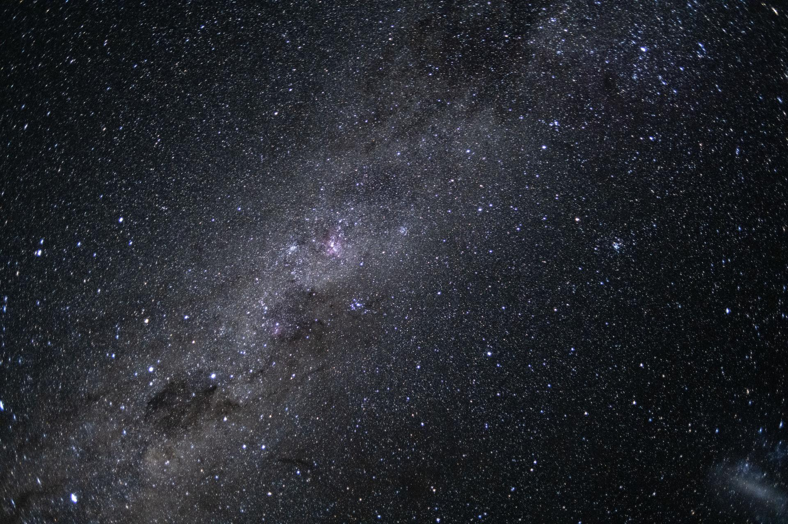

# Artemis II Crew Captures Spectacular Milky Way Photo from Beyond the Moon

**Summary:** NASA's Artemis II crew captured a stunning photo of our galaxy, the Milky Way, on April 7, 2026, during their historic journey around the Moon aboard the Orion spacecraft. The image shows the galaxy's elegant spiral structure dominated by two major arms wrapping off the ends of a central bar of stars.

*Credit: NASA*

On April 7, 2026, the four astronauts of NASA's Artemis II mission captured a breathtaking photo of the Milky Way galaxy from their position in deep space, approximately midway between Earth and the Moon. The image was released as part of NASA's "Starstruck" feature, showcasing the galactic vista that the crew witnessed during their journey beyond low Earth orbit.

## A Historic Journey

Artemis II launched on April 1, 2026, carrying four astronauts on the first crewed lunar flight since Apollo 17 in 1972. The crew includes:

- **Commander Reid Wiseman** — who captured the Milky Way photo from Orion's main window
- **Pilot Victor Glover**
- **Mission Specialist Christina Koch**
- **Mission Specialist Jeremy Hansen** (Canadian Space Agency)

After performing a translunar injection (TLI) burn on April 2, the crew entered a free-return trajectory around the Moon, traveling farther from Earth than any humans in more than half a century.

## The Image

The photo, officially designated **art002e012588**, reveals the Milky Way's elegant spiral structure dominated by just two arms wrapping off the ends of a central bar of stars. The image was described by NASA as one of the most remarkable photos ever captured from deep space.

The astronauts also witnessed a solar eclipse during their journey and captured imagery of Earth setting behind the Moon — scenes described by NASA officials as "phenomenal" and "for the ages."

## Mission Status

As of April 10, 2026, the Artemis II crew successfully returned to Earth, splashing down in the Pacific Ocean off the coast of San Diego after a 10-day mission. The Orion spacecraft performed flawlessly during the mission, with NASA officials noting that all subsystems continued to operate "very well" and "nominally."

## Scientific and Cultural Significance

The image represents both a scientific milestone and a cultural touchstone for a new generation of space exploration. Unlike the iconic "Earthrise" photo from Apollo 8, which showed our home planet against the stark lunar surface, the Artemis II Milky Way photo places humanity in the context of the broader cosmos — a perspective made possible by venturing beyond the Moon's orbit.

> Background: Artemis II is the first crewed mission of NASA's Artemis campaign, aimed at returning humans to the Moon and establishing a sustainable presence there as a stepping stone to Mars. The mission follows the successful uncrewed Artemis I flight in 2022.

## Sources (original pages)

- [NASA: Starstruck — Artemis II crew captures Milky Way photo](https://www.nasa.gov/news/all-nasa-news/)
- [NASA: Artemis II News and Updates](https://www.nasa.gov/artemis-ii-news-and-updates/)
- [NASA Image and Video Library: art002e012588](https://images.nasa.gov/)
