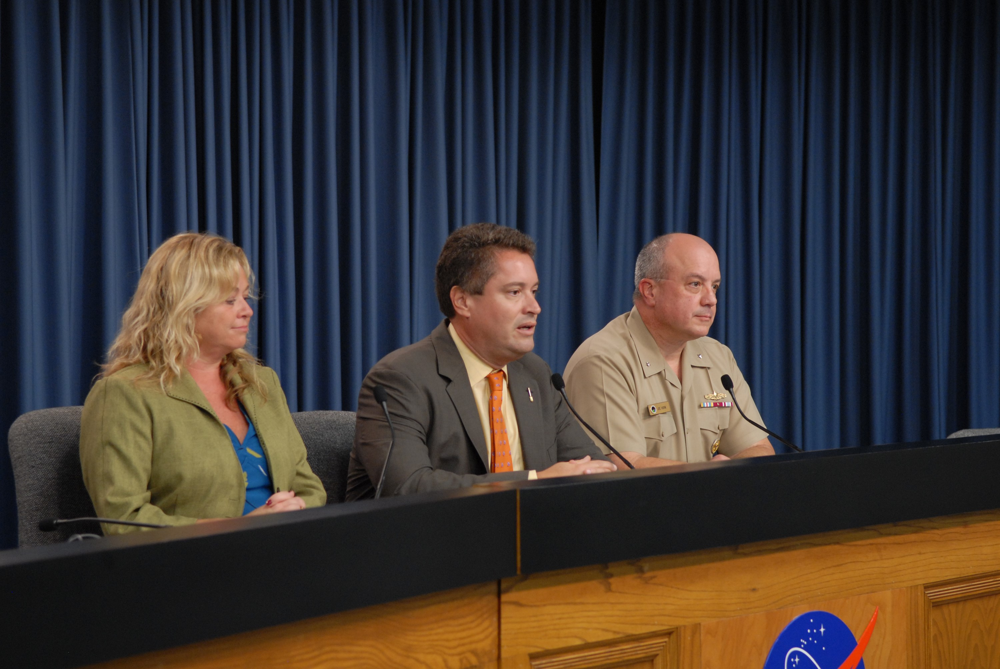

# SpaceX, Lockheed Martin Among 12 Companies Awarded $3.2B U.S. Space-Based Interceptor Contracts

**Summary:** On April 25, the U.S. Space Force announced contracts worth up to $3.2 billion awarded to 12 companies—including SpaceX and Lockheed Martin—to develop space-based interceptor prototypes under President Trump's Golden Dome missile defense program. The interceptors are designed to destroy enemy missiles outside Earth's atmosphere and are required to demonstrate capabilities by 2028.

*Conceptual illustration of a space-based interceptor system (image: NASA)*

## Contract Background

The U.S. Space Force announced the suite of contracts on April 25, requiring the 12 contractors to demonstrate space-based interceptor capabilities by 2028. The awarded companies include:

- **SpaceX** (Space Exploration Technologies)
- **Lockheed Martin Corp.**
- **Anduril Industries Inc.**
- **Booz Allen Hamilton Inc.**
- **General Dynamics Corp.**
- And 7 other companies

## The Golden Dome Program

Golden Dome is a major missile defense infrastructure initiative pushed by President Trump, who signed an executive order in January 2026 designating missile attack as "the most catastrophic threat facing the United States" and committing to a new generation of space-based missile interception systems.

The core concept behind space-based interceptors is deploying interception vehicles in Earth orbit to destroy enemy ballistic missiles before they re-enter the atmosphere. Compared to traditional ground-based systems, space-based systems offer potentially shorter response times and broader coverage, though the technical complexity and costs are substantial.

## Strategic Implications

These interceptors are a critical component of the Golden Dome architecture, but the technology remains unproven in combat conditions. The $3.2 billion in contracts is primarily for prototype development and demonstration. Final deployment decisions and scale will depend on prototype test results and subsequent Congressional appropriations.

The inclusion of SpaceX—a company that simultaneously operates commercial launch services—has drawn scrutiny over potential conflicts of interest, as the company grows increasingly intertwined with government defense programs.

> Background: On January 27, 2026, President Trump signed an executive order formally launching the Golden Dome program as the centerpiece of U.S. missile defense modernization. The program's name draws inspiration from Reagan-era Strategic Defense Initiative (SDI), dubbed the "Star Wars" program.

## Sources (original pages)

- [Sina Finance: SpaceX, Anduril Among Companies Awarded Space Interceptor Contracts](https://finance.sina.com.cn/stock/bxjj/2026-04-25/doc-inhvrtin4169123.shtml)
