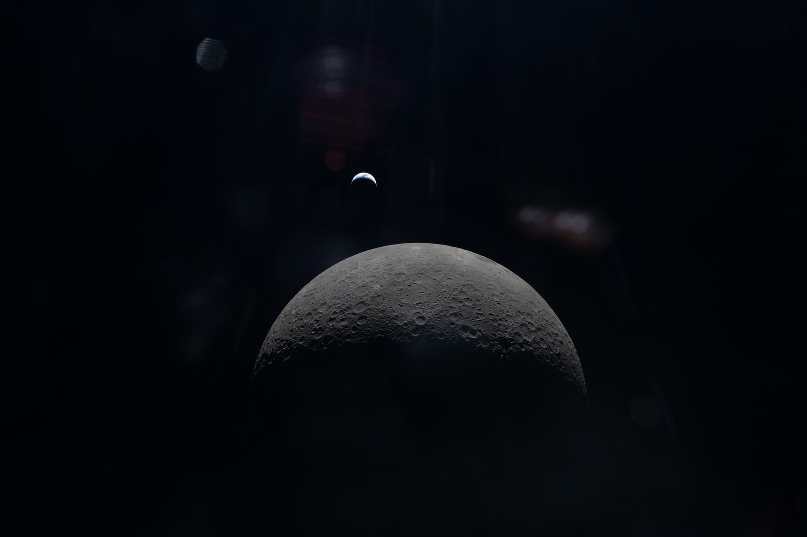
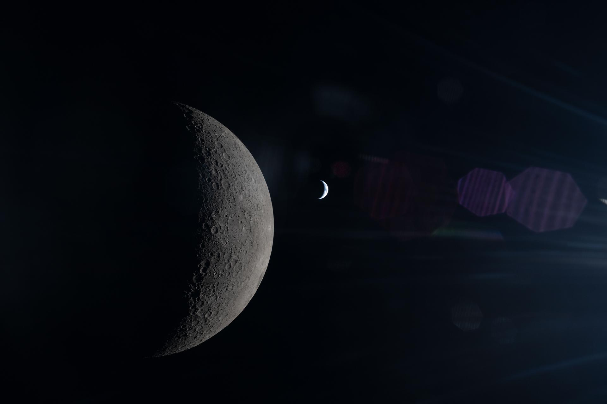

# Artemis II Crew Captures Stunning 'Earthset' Photo from Orion Spacecraft

**Summary:** On April 6, 2026, the four astronauts aboard NASA's Artemis II mission captured a breathtaking photograph of Earth setting behind the Moon from their Orion spacecraft. The image, designated art002e015231, shows Earth disappearing below the lunar horizon—a cosmic counterpart to the famous "Earthrise" photos taken by Apollo astronauts.

*Credit: NASA (Public Domain)*

On April 6, 2026, during the sixth day of their journey to the Moon, the four astronauts aboard NASA's Artemis II mission captured a series of historic images. The most stunning shows Earth slowly setting behind the Moon's shadow—a cosmic "sunset" unlike anything seen before by human eyes.

## A Historic Moment

Artemis II launched from Kennedy Space Center on April 1, 2026, marking humanity's first crewed lunar flyby mission in over 50 years. On day six of the mission (April 6), as the Orion spacecraft swung around the far side of the Moon, it lost radio contact with Earth for approximately 40 minutes—purely because the Moon itself blocked the signal. It was during this brief "comm blackout" that the astronauts captured these extraordinary photographs.

*Credit: NASA (Public Domain)*

The photograph shows Earth descending slowly above the lunar surface, with the Moon's rough terrain and craters clearly visible. This creates a striking contrast with the iconic "Earthrise" photos taken by Apollo astronauts—if those showed Earth rising above the lunar horizon, this image captures the reverse: Earth setting below it.

## Artemis II Mission Overview

Artemis II is NASA's first crewed flight test of the Artemis program. The four crew members are:

- **Commander Reid Wiseman**
- **Pilot Victor Glover**
- **Mission Specialist Christina Koch**
- **Mission Specialist Jeremy Hansen (CSA)**

The mission launched on April 1 and completed its Translunar Injection (TLI) burn on April 2, entering a free-return lunar orbit. Over 10 days, the crew set multiple records, including traveling farther from Earth than any humans in more than 50 years.

*Credit: NASA (Public Domain)*

## Mission Success

Artemis II concluded successfully on April 10, with the Orion spacecraft splashing down in the Pacific Ocean off the coast of San Diego, California. All four astronauts returned safely to Earth after the approximately 10-day mission, having traveled farther from Earth than any humans in more than half a century.

NASA Science released these images during Earth Day celebrations on April 22, describing them as "truly spectacular" and "epoch-making."

## Sources (original pages)

- [NASA: Welcome Home – Artemis II crew returned to Earth](https://www.nasa.gov/)
- [NASA Science: Earth Day 2026](https://science.nasa.gov/)
- [NASA Image and Video Library: art002e015231](https://images.nasa.gov/)
