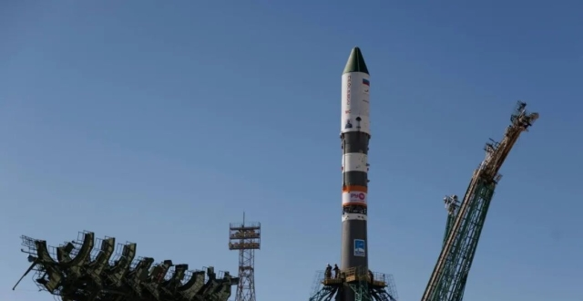

# Russia Launches Progress MS-34 Cargo Spacecraft to ISS

**Summary:** On April 26, 2026, Russia's Progress MS-34 cargo spacecraft was launched aboard a Soyuz-2.1a rocket from the Baikonur Cosmodrome in Kazakhstan, delivering over 2.5 tonnes of food, propellant, and other supplies to the International Space Station. The spacecraft has entered its designated orbit and is scheduled to dock with the Zvezda service module of the ISS Russian segment on April 28.

*Credit: Xinhua / Toutiao*

## Sources (original pages)

- [Russia Launches Progress MS-34 Cargo Spacecraft to ISS - Toutiao](https://www.toutiao.com/article/7632934124046615046/)
- [Russia Launches Cargo Spacecraft to ISS from Kazakhstan - Tencent News](https://new.qq.com/rain/a/20260426A038O400)
- [Russia's 8th Launch of 2026 - Tencent News](https://so.html5.qq.com/page/real/search_news?docid=70000021_26269ed58fd72652)
