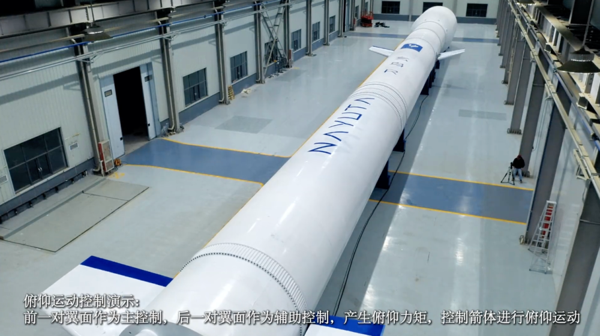

# Nayuta Space's Qianniao-R Full-Scale Test Rocket Unveiled, China's Aerodynamic Recovery Tech Advances

**Summary:** On April 25, at the Space Day of China 2026 events, Nayuta Space's Co-CTO Wang Shilei announced that the company's full-scale test vehicle for the Qianniao-R—China's only rocket employing aerodynamic deceleration recovery—has been officially completed, with control surface electrical integration tests successfully conducted. The rocket uses a novel "aerodynamic deceleration + horizontal landing" technology route, distinctly different from SpaceX Falcon's vertical landing approach.

*Credit: Nayuta Space (Authorized for media use)*

On April 25, at the Space Day of China 2026 activities, Nayuta Space's Co-CTO Wang Shilei introduced the latest progress of the Qianniao-R rocket to media. He announced that the full-scale test vehicle has been officially completed, and control surface electrical integration tests have been successfully conducted. Under servo system control, the control surfaces simulated four different rocket maneuver scenarios in various flight conditions, laying the foundation for subsequent flight tests.

## A Differentiated Technology Route: "Aerodynamic Deceleration + Horizontal Landing"

Unlike other Chinese commercial aerospace companies that adopt vertical landing recovery (such as LandSpace's Zhuque-3), Nayuta Space has chosen the "aerodynamic deceleration + horizontal landing" technology route. Key characteristics:

- **First achieve precise recovery and reuse of first-stage rockets**: The first stage decelerates through aerodynamic drag during return
- **Horizontal landing**: Compared to vertical landing, this approach has lower precision requirements for landing sites, more suitable for ordinary runways or simple flat surfaces
- **Technology can be extended to second-stage recovery after maturity**

Wang Shilei explained that after this scheme matures, it will be gradually applied to second-stage rocket recovery, further reducing launch costs.

## Development Progress and Funding

Nayuta Space, as China's only overall design unit for aerodynamic deceleration recovery rockets, has recently completed PreA1-A3 funding rounds consecutively. The raised funds will primarily be used for:

- Secondary static ignition tests of the Qianniao-R launch vehicle
- Aerodynamic deceleration scaled flight tests
- Wind tunnel tests
- Deepened R&D of core aerodynamic recovery technologies

## Maiden Flight Plan

Nayuta Space has set its sights on achieving the Qianniao-R maiden flight in H1 2027. The primary mission objective is to ensure the payload enters orbit smoothly, with a controlled recovery test during return to collect relevant data and iterate the aerodynamic deceleration recovery technology.

## Comparison with Other Reusable Rockets in China

| Company | Rocket Model | Recovery Technology Route |
|---------|-------------|--------------------------|
| CASC | Long March 10B (CZ-10B) | Sea-based net recovery (vertical landing) |
| LandSpace | Zhuque-3 | Vertical landing (legs) |
| Nayuta Space | Qianniao-R | Aerodynamic deceleration + horizontal landing |

Three technology routes advancing in parallel marks China's commercial aerospace forming a diversified technology exploration landscape in the field of reusable rockets.

## Sources (original pages)

- [Nayuta Space Official Website](https://www.nayuta.space/)
- [Dazhong News: Progress update on China's only aerodynamic deceleration recovery rocket](https://new.qq.com/rain/a/20260426A02MAX00)
- [Beijing News: Nayuta Space completes PreA1-A3 funding rounds](https://new.qq.com/rain/a/20260424A07E1M00)
