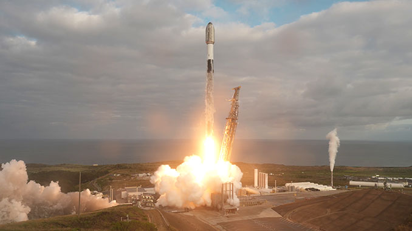

# SpaceX Completes 50th Falcon 9 Launch of 2026

**Summary:** On April 26, 2026, SpaceX successfully completed its 50th Falcon 9 launch of the year from Vandenberg Space Force Base in California, deploying 25 Starlink V2 Mini broadband internet satellites and adding another record to the company's 603-booster recovery tally.

*Credit: SpaceX via Spaceflight Now*

At 7:37 a.m. PDT (10:37 a.m. EDT / 14:37 UTC) on April 26, a SpaceX Falcon 9 rocket lifted off from Space Launch Complex 4 East at Vandenberg Space Force Base, carrying the Starlink 17-16 mission under cloudy skies. The rocket placed 25 of SpaceX's Starlink V2 Mini broadband internet satellites into a southerly trajectory from the central California coast.

The mission utilized first stage booster B1088, marking its 15th flight following launches including NROL-126, Transporter-12, SPHEREx, and NROL-57, plus 10 previous Starlink batches. Approximately 8.5 minutes after liftoff, B1088 achieved a precise landing on SpaceX's autonomous drone ship, Of Course I Still Love You — the 193rd landing on that vessel and the 603rd booster recovery in SpaceX's history.

SpaceX confirmed successful deployment of all 25 Starlink satellites from the second stage approximately one hour into flight.

As of April 26, SpaceX has completed 50 Falcon 9 launches in 2026, averaging one launch every 1.8 days. At this pace, SpaceX is on track to approach 200 launches for the full year, a dramatic increase from its 2024 annual record of 96 launches.

## Sources (original pages)

- [Spaceflight Now - SpaceX flies 25 Starlink satellites to orbit on its 50th Falcon 9 launch of the year](https://spaceflightnow.com/2026/04/26/live-coverage-spacex-to-fly-25-starlink-satellites-on-its-50th-falcon-9-launch-of-the-year/)
