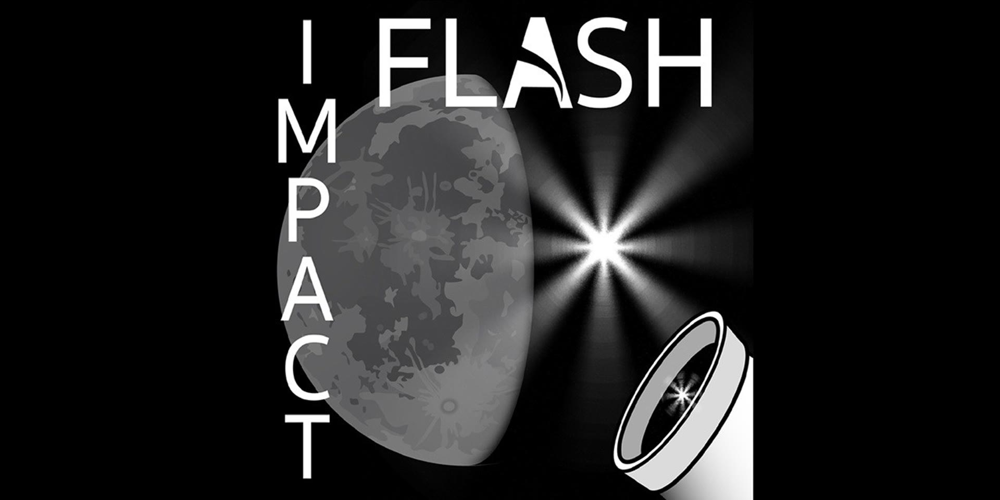

# Artemis II Astronauts Observe Lunar Meteoroid Impacts During Mission

**Summary:** During the Artemis II mission in early April 2026, as astronauts traveled around the Moon, they observed flashes of light caused by meteoroids striking the lunar surface. Simultaneously, volunteers for the NASA-funded Impact Flash project on Earth scanned the Moon with their own telescopes and sent videos to scientists tracking the same impacts — a unique collaboration between crewed deep space observation and ground-based citizen science.

*Credit: NASA / Citizen Science*

## Sources (original pages)

- [Volunteers Help NASA Astronauts Record Lunar Flashes](https://science.nasa.gov/get-involved/citizen-science/volunteers-help-nasa-astronauts-record-lunar-flashes/)

> Published April 27, 2026.
