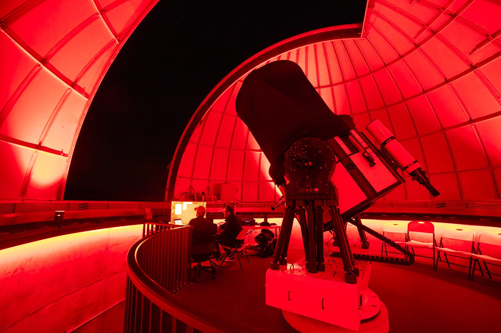

# NASA Invites Public to Join Citizen Science: Everyone Can Be Part of Space Exploration

**Summary:** On April 27, NASA published an article titled "You Can Help Humans Thrive in Space," detailing how the public can participate in space exploration through citizen science projects. During the Artemis II mission, volunteer scientists assisted in observing lunar impact flashes, and NASA has invited the public to take part in pepper plant cultivation tests for future deep space missions.

*Credit: NASA / Bryan Simpson*

## Citizen Science: Everyone Can Participate in Space Exploration

On April 27, 2026, NASA published a feature article on how the public can engage in space exploration through citizen science projects. During the Artemis II mission, NASA-funded citizen science volunteers around the world used telescopes to observe and record flashes caused by meteoroids hitting the lunar surface, forming a coordinated Earth-space observation campaign with the astronauts orbiting the Moon.

Artemis II was the first crewed deep-space flight since Apollo 17 in 1972, with four astronauts completing a lunar flyby and returning to Earth in early April. NASA stated: "Not everyone gets a chance to put on a space suit, but you can still be an important part of NASA's human space exploration story by doing NASA science!"

## Volunteers Observe Lunar Impact Flashes

During the Artemis II crew's Lunar Flyby maneuver, astronauts observed flashes caused by meteoroids hitting the far side of the Moon (the side not visible from Earth). Meanwhile, citizen science volunteers on Earth tracked the same impact events through observation networks such as the Lunar Impact Flash and Atmospheric Transient Events (LIADA) network.

This coordinated Earth-space observation data helps scientists more precisely understand the distribution of small bodies near the Moon, providing orbital safety data for future crewed lunar missions.

## Space Pepper Cultivation Experiments

The article also highlighted another citizen science project: space pepper cultivation testing. Volunteers helped test different pepper varieties' growth characteristics in space environments, providing data to support plant cultivation systems for future long-duration space missions.

Additionally, citizen scientists participate in research projects across fields including solar activity monitoring, satellite optical observations, and meteoroid observations.

## How to Join NASA Citizen Science Projects

NASA offers various citizen science projects on its official website for public participation, covering astronomy, Earth science, solar physics, and other fields. No professional background is required—just a telescope or internet connection to contribute to real scientific research.

For more information: https://science.nasa.gov/get-involved/citizen-science/

## Sources (original pages)

- [You Can Help Humans Thrive in Space - NASA Science](https://science.nasa.gov/get-involved/citizen-science/you-can-help-humans-thrive-in-space/)
