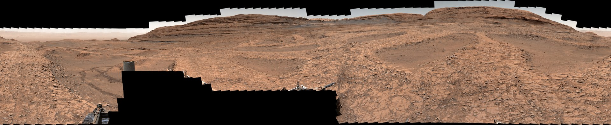

# NASA's Curiosity and Perseverance Rovers Release Simultaneous 360-Degree Panoramas of Mars

**Summary:** NASA's Curiosity and Perseverance rovers have simultaneously released their respective 360-degree panoramic images of Mars. Curiosity's panorama, stitched from 1,031 images taken over nearly a month, focuses on ancient boxwork terrain in Gale Crater. Perseverance's panorama, composed of 980 images, captures the Jezero Crater rim area known as "Lac de Charmes." The two rovers—one old and one new, one climbing up and one descending—are effectively "time traveling" through Mars' geological history simultaneously, providing unprecedented comparative data for scientists understanding Mars' formation, watery past, and ancient habitable conditions.

*Credit: NASA/JPL-Caltech/ASU/MSSS/ESA/University of Arizona/JHUAPL/USGS*

## Curiosity: A Geological Time Machine Through 3.8 Billion Years

Curiosity's panorama was stitched from 1,031 images taken between November 9 and December 7, 2025, offering a detailed view of a region filled with vast boxwork formations. Resembling giant spiderwebs in orbiter images, these low ridges were created by groundwater that once flowed through large fractures in the bedrock. The minerals left behind hardened the rock along the fractures, resulting in erosion-resistant ridges that form this unique landscape.

When Curiosity landed on the floor of Gale Crater in 2012, it set out to determine whether Mars once had conditions to support life. Within a year, a sample drilled from an ancient lakebed confirmed those conditions had been present, including the right chemistry and potential nutrients for microbes. Since 2014, Curiosity has been ascending Mount Sharp—a 5-kilometer-high mountain that first began forming when layers of sediment were deposited in a series of lakes. Because the lowest layers are oldest and higher layers are youngest, Curiosity is essentially progressing back through geological time as it slowly climbs the mountain.

In 2025, the mission team documented how the mineral siderite might be storing carbon dioxide that once was part of a thicker, early Martian atmosphere. That same year, they announced the detection of three of the largest organic molecules ever found on Mars in a sample drilled in 2013—the discovery of long-chain hydrocarbons, possibly remnants of fatty acids, marked a milestone in the search for more complex prebiotic chemistry on the Red Planet. In 2026, the team further announced that a rock Curiosity drilled and analyzed in 2020 contains the most diverse collection of organic molecules ever found on Mars: of the 21 carbon-containing molecules identified, seven were detected for the first time on Mars.

## Perseverance: Ancient Terrain and Evidence of Life

Perseverance landed in Mars' Jezero Crater in 2021 to study the origin of ancient rocks within the crater and to hunt for evidence that microbial life once existed. Billions of years ago, molten rock cooled to form the floor of Jezero Crater. A river then fed a lake in the crater, leaving behind sediments where traces of microbes could have been preserved. In 2024, the mission discovered a rock nicknamed "Cheyava Falls" that was dotted with "leopard spots"—a pattern formed by chemical reactions that microbes are known to create in rocks on Earth.

Perseverance's panorama focuses on "Lac de Charmes," outside the rim of Jezero Crater. Taken between December 18, 2025, and January 25, 2026, 980 images were stitched together for a 360-degree view capturing the Jezero rim and ancient rocks around the crater.

Unlike Curiosity, which pulverizes rock samples for analysis, Perseverance collects intact rock cores—each about the size of a piece of blackboard chalk—and stores them in metal tubes. Aside from a backup set of 10 tubes deposited in a sample depot, Perseverance keeps all 23 of its samples onboard. Scientists hope to get these samples to Earth-based laboratories where they can investigate them with instruments far bigger and more complex than those that can be sent to Mars.

Additionally, Perseverance's microphones captured the first recordings of electrical sparks in passing dust devils—a phenomenon that had only been theorized before. Another study detailed how one of Perseverance's sensitive cameras was able to capture the first visible light auroras from the surface of another planet.

## Excavating Mars' History From Both Ends

The two rovers are currently separated by about 3,775 kilometers—roughly the distance from Los Angeles to Washington, D.C.—yet each is doing something seemingly "opposite": the nearly 15-year-old Curiosity is ascending Mount Sharp, heading toward ever-younger terrain, while the 5-year-old Perseverance is venturing into some of the oldest landscapes in the entire solar system. By "time traveling" in opposite directions, the rovers are filling in missing details about the planet's history.

Curiosity has left the boxwork region behind and continues to explore a mountain layer enriched in salty minerals called sulfates. Perseverance will keep heading toward locations holding exceptionally old terrain, including one called "Singing Canyon."

> Managed for NASA by Caltech, NASA's Jet Propulsion Laboratory in Southern California built and manages operations of both Curiosity and Perseverance on behalf of the agency's Science Mission Directorate as part of NASA's Mars Exploration Program portfolio.

## Sources (original pages)

- [NASA's Perseverance, Curiosity Panoramas Capture Two Sides of Mars](https://www.nasa.gov/solar-system/planets/mars/nasas-perseverance-curiosity-panoramas-capture-two-sides-of-mars/)
