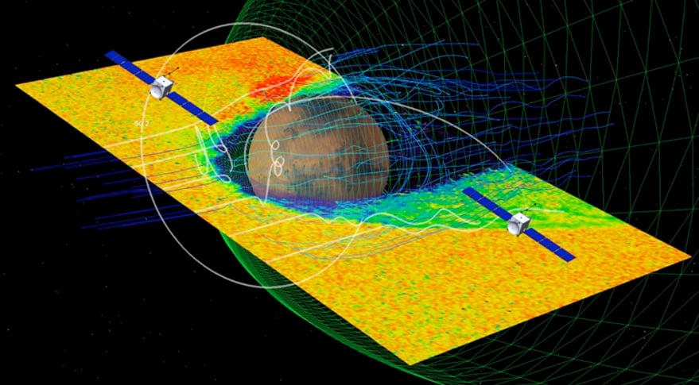

# Rocket Lab Completes Spacecraft Commissioning for NASA's ESCAPADE Mars Mission

**Summary:** On April 27, Rocket Lab announced the successful completion of commissioning for the twin satellites of NASA's ESCAPADE (Escape and Plasma Acceleration and Dynamics Explorers) Mars mission. Both spacecraft are now successfully operating at the Earth-Sun Lagrange Point 2 (L2) and preparing for handover to the University of California Berkeley Space Sciences Laboratory (UCB-SSL).

*Credit: Rocket Lab*

## Mission Overview

ESCAPADE is led by UC Berkeley's Space Sciences Laboratory, with mission management from NASA's Jet Propulsion Laboratory (JPL). Rocket Lab served as the primary contractor responsible for designing and building both identical satellite platforms.

After launching in early 2026, the twin satellites underwent several months of on-orbit commissioning with all systems verified and operational. They are currently stable at L2 and preparing for trajectory correction maneuvers toward Mars, with arrival planned around 2028.

## Spacecraft Configuration

Each ESCAPADE satellite carries multiple scientific payloads designed to study the interaction between Mars' atmosphere and the solar wind. The spacecraft utilize a modular platform design with high integration and low power consumption, meeting the stringent requirements of deep space exploration missions.

Rocket Lab stated that the successful commissioning of the twin platforms validates its spacecraft systems engineering capabilities in deep space exploration, laying the foundation for future deep space missions.

## Next Steps

Following commissioning completion, Rocket Lab will transfer operational control of the satellites to UCB-SSL. The UCB-SSL team will handle science operations and continue preparations for the Mars transfer phase. ESCAPADE will be the first mission to use dual-spacecraft formation flying technology for comprehensive observation of Mars' magnetosphere.

## Sources (original pages)

- [Rocket Lab Completes Spacecraft Commissioning for NASA's ESCAPADE Mars Mission](https://www.rocketlabusa.com/updates/rocket-lab-completes-spacecraft-commissioning-for-nasas-escapade-mars-mission/)
