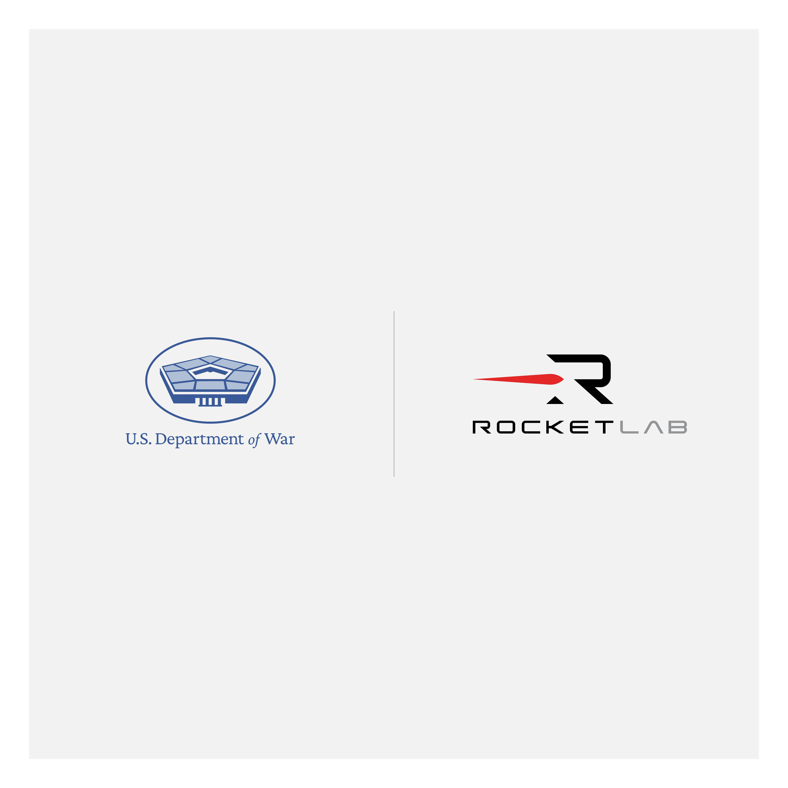

# Rocket Lab Secures $190M HASTE Contract for 20 Hypersonic Test Flights

**Summary:** On April 27, Rocket Lab announced its single largest launch agreement to date: a $190 million contract for a block buy of 20 HASTE hypersonic test flights with the US Department of Defense Test Resource Management Center (TRMC) Multi-Service Advanced Capability Hypersonics Test Bed (MACH-TB) 2.0 program. The program is executed in partnership with Naval Surface Warfare Center Crane Division (NSWC Crane) to rapidly accelerate hypersonic flight tests and advanced aerospace technologies.

*Credit: Rocket Lab*

## Contract Overview

This $190 million contract represents Rocket Lab's largest single launch agreement in its history, involving a block purchase of 20 HASTE rockets. HASTE (Hypersonic Accelerator Suborbital Test Aircraft) is Rocket Lab's hypersonic test platform, designed specifically to meet the high-frequency hypersonic testing needs of US government and military customers.

The MACH-TB 2.0 program is led by the US Department of Defense Test Resource Management Center, with participation from the Naval Surface Warfare Center Crane Division. It aims to establish sustainable hypersonic flight testing capabilities and accelerate the operationalization of US hypersonic weapons and aerospace technologies.

## HASTE Program Progress

Since entering service, the HASTE rocket has successfully completed multiple hypersonic test flights, accumulating extensive flight data and operational experience. Rocket Lab continues to improve HASTE platform performance, enhancing its payload capacity and flight envelope to meet various hypersonic testing mission requirements.

This additional contract will further expand HASTE launch frequency, helping the US military rapidly iterate hypersonic technologies and validate various hypersonic combat concepts and advanced aerospace technologies.

## Strategic Significance

Rocket Lab stated that hypersonic technology is a key domain for future national security and aerospace competition. The HASTE platform can provide flexible, reliable, and cost-effective hypersonic testing capabilities, which is of great significance for maintaining US leadership in the hypersonic field.

Through the MACH-TB program, Rocket Lab will continue to deepen cooperation with the US Department of Defense, consistently providing high-level hypersonic testing services and supporting US technological breakthroughs in hypersonic aircraft, missiles, and space launch domains.

## Sources (original pages)

- [Rocket Lab Secures $190M Contract for 20x HASTE Launches, Cements Hypersonics Leadership with Department of War Partnership](https://www.rocketlabusa.com/updates/rocket-lab-secures-190m-contract-for-20x-haste-launches-cements-hypersonics-leadership-with-department-of-war-partnership/)
