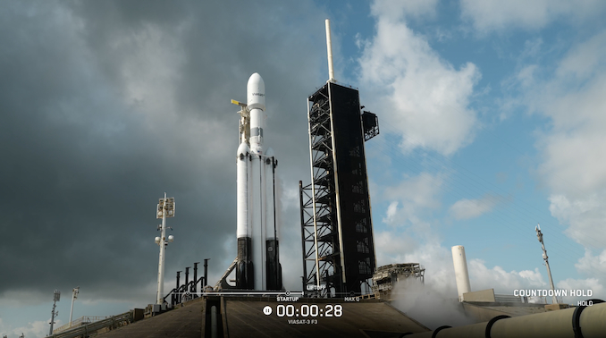

# SpaceX Scrubs Falcon Heavy Launch of Final ViaSat-3 Satellite Due to Poor Weather

**Summary:** SpaceX was standing down from launching its first Falcon Heavy rocket in more than a year and a half due to poor weather on Monday, April 27. The mission was to deploy the ViaSat-3 Flight 3 communications satellite—the final satellite in Viasat's third-generation broadband constellation—into a geosynchronous transfer orbit. A new launch date has not yet been announced.

*Credit: Spaceflight Now*

## Mission Overview

The mission was planned to lift off from NASA's Kennedy Space Center, with the triple-booster Falcon Heavy sending the 6-metric-ton ViaSat-3 Flight 3 communications satellite to a geosynchronous transfer orbit. After separation from the rocket's upper stage, the satellite would use its own propulsion system to reach geostationary orbit.

Mission details:

- **Vehicle:** Falcon Heavy (first flight in over 18 months)
- **Payload:** ViaSat-3 Flight 3 (third and final satellite in Viasat's third-generation constellation)
- **Target Orbit:** Geostationary Transfer Orbit (GTO)
- **Launch Site:** NASA's Kennedy Space Center
- **Booster Recovery:** Planned land recovery of two side boosters at Cape Canaveral Space Force Station

## Weather and Technical Status

SpaceX called off the mission at 10:48 a.m. EDT (1448 UTC) on April 27, citing poor weather conditions at the launch site. This was the final attempt within the launch window, and a new launch date is expected to be announced soon.

Viasat's Dave Abrahamian said prior to the scrub: "It's kind of the end of an era. We've been working this program for over 10 years now." The ViaSat-3 constellation is designed to provide high-speed broadband internet services across the Americas, with Flight 1 and Flight 2 having launched in May 2023 and May 2024 respectively.

## Background: Falcon Heavy Returns

This mission would have marked Falcon Heavy's return to flight after a hiatus of over a year and a half. The Falcon Heavy is SpaceX's most powerful operational rocket, consisting of three first-stage boosters based on the Falcon 9. Its two side boosters are designed for vertical landing and reuse. The rocket serves a wide range of commercial, government, and deep-space missions.

## Sources (original pages)

- [SpaceX scrubs Falcon Heavy launch of final ViaSat-3 satellite due to poor weather](https://spaceflightnow.com/2026/04/27/live-coverage-spacex-to-launch-final-viasat-3-satellite-on-falcon-heavy-rocket/)
