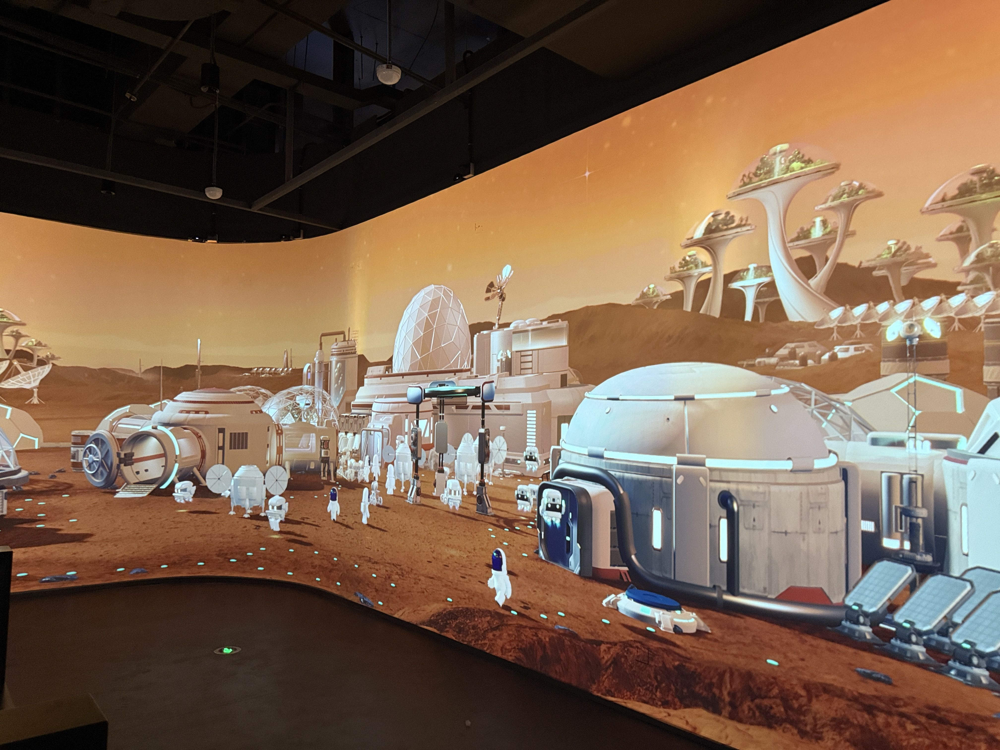

# China (Beijing) Space Science Center Opens, Marking New Landmark for Science-Tourism Integration

**Summary:** On April 28, 2026, the China (Beijing) Space Science Center officially opened at the Chaoji Heshenghui complex in Beijing's Changping District. The 3,700-square-meter immersive space science and education complex, guided by the Deep Space Exploration Laboratory and the Beijing Institute of Space Science and Technology Information, features six themed exhibition halls, four professional laboratories, and eight pioneering interactive experiences — offering visitors a first-hand perspective on China's space program.

*Credit: BJNews (reproduced with permission)*

## Six Themed Exhibition Halls: A Complete Journey from Earth to Deep Space

The center comprises six themed halls — the Prelude Hall, Rocket Launch Site, Satellite Research Institute, Tiangong Space Station, Lunar Base, and Deep Space Exploration Center — interconnected with four professional laboratories (Rocket, Satellite, Deep Space, and AI), forming a closed-loop experience that integrates exhibition, education, and research activities.

- **Prelude Hall**: A "Time Tunnel" composed of 100 milestones in Chinese space history, allowing visitors to trace the complete development arc of China's space program
- **Rocket Launch Site**: Full-scale还原 (restoration) of rocket assembly, testing, transfer, and launch processes; visitors can personally "launch" a rocket and experience the countdown immersion
- **Satellite Research Institute**: In-depth exploration of satellite internal structures and the precise engineering logic from design to testing, featuring an anechoic chamber
- **Tiangong Space Station**: A 1:1 full-scale replica of the Tiangong core module, offering a astronaut's-eye view of the blue Earth and unique space experiences such as "inverted space"
- **Lunar Base**: Lunar landing zone with spacesuit try-ons and lunar rover test drives
- **Deep Space Exploration Center**: Digital recreation of Martian landscapes and a comprehensive preview of future deep space exploration missions, featuring a full-scale controllable model of the Zhurong Mars rover

The center also displays a lineup of 22 Long March rocket models at 1:45 scale.

## Eight Pioneering Experiences: Genuine "Hardcore" Space Science Outreach

Distinguishing itself from generic space-themed venues, the center establishes competitive barriers through eight pioneering experiences:

1. First-ever disassembly of a nearly 30-meter giant rocket
2. First holographic presentation of China's space station six-module configuration
3. First panoramic display of crewed lunar landing plans
4. First lunar base construction simulation game
5. First highly authentic exhibition of the Zhurong Mars rover
6. First deep space digital immersion experience
7. First systematic presentation of future deep space exploration blueprints
8. "Super Engineer" immersive space practice interactive system

Visitors can also use a "wind tunnel testing" device to assemble their own aircraft and observe how airflow disturbances affect flight attitude.

## 50 Million Yuan Investment Fills Gap in Beijing's Space Science Education

The China (Beijing) Space Science Center is jointly built by Beijing Deep Space Exploration Technology Co., Ltd. and Beijing Changping Cultural Tourism Development Group Co., Ltd., with an investment of 50 million yuan. Guided by the national strategy of "Exploring the Vast Universe, Building a Space Power," the project is professionally supported by Beijing Shenzhou Aerospace Culture and Creative Media Co., Ltd. and Deep Space Exploration Technology (Beijing) Co., Ltd.

The center adopts a "Exhibition–Courses–Camps–Competitions" four-wheel drive business model, organically integrating research-focused services for educational institutions with consumer-oriented experiences for families — ensuring both scientific depth and entertainment value while balancing operational efficiency. Following its opening, the center will be open to social organizations, schools, and individual visitors, and plans to link with Changping's cultural tourism resources to create a new landmark for integrated science, culture, commerce, and tourism in Beijing.

## Sources (original pages)

- [BJNews: China (Beijing) Space Science Center Opens](https://www.bjnews.com.cn/detail/1777345357129659.html)
- [CNR.cn: China (Beijing) Space Science Center to Open on April 28](https://www.sohu.com/a/1015280603_362042)
- [Toutiao: China (Beijing) Space Science Center Opens Today](https://www.toutiao.com/article/7633639831176544787/)
- [Tencent News: Changping Space Science Popularization New Museum Opens](https://new.qq.com/rain/a/20260428A02JRX00)
