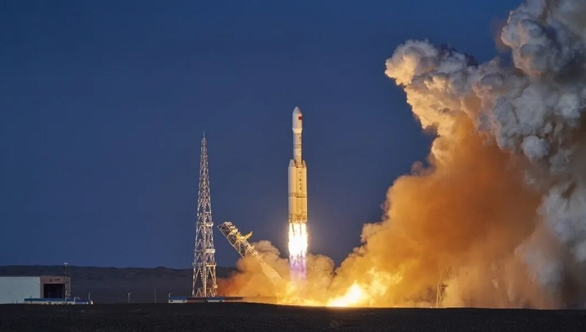

# CAS Space's Lijian-2 Super Factory Fully Completed, Mass Production Line Officially Commissioned

**Summary:** On April 28, 2026, CAS Space's Lijian-2 large liquid launch vehicle super factory in Keqiao District, Shaoxing, Zhejiang Province was fully completed and officially commissioned. As a key project in Zhejiang Province's "Thousands of Projects and Trillions" initiative, the factory has successfully completed the construction of core functional areas including R&D, production, assembly, testing, and operations. Once fully operational, it will have an annual production capacity of 12 Lijian-2 liquid launch vehicles, marking a significant milestone for China's commercial space industry transitioning from technology verification to mass production. Just over a month earlier, on March 30, 2026, the Lijian-2 Yaoyi-1 launch vehicle successfully completed its maiden flight, achieving a seamless connection between "successful maiden flight" and "production capacity delivery."

*Credit: Sina News*

## Factory Overview and Production Capacity

The Lijian-2 super factory is located in the Keqiao District Economic and Technological Development Zone in Shaoxing, Zhejiang Province. It serves as CAS Space's core manufacturing base in the industrial layout of liquid launch vehicles. The factory covers production areas for key liquid rocket components including propellant tanks, pipelines and valves, interstage sections, and conduits. The comprehensive workshop is equipped with a rocket pulse-type assembly and testing production line, which decomposes rocket assembly into multiple fixed stations where multiple rockets simultaneously flow through the process in parallel and continuous production.

Lian Jie, Deputy Chief Designer of the Lijian-2 rocket, explained that within 3 to 5 years after the factory's commissioning, the team will continuously improve Lijian-2's production efficiency, striving to shorten the assembly and testing cycle to within 2 months and achieve the full production capacity of 12 vehicles per year to support high-frequency and stable launch missions.

## Technical Characteristics of Lijian-2

The Lijian-2 is China's first launch vehicle adopting the Common Booster Core (CBC) configuration, with the following technical parameters:

| Parameter | Value |
|-----------|-------|
| Common Core Diameter | 3.35m |
| Fairing Diameter (Maiden Flight Configuration) | 4.2m |
| Total Length | 53m |
| Liftoff Weight | 625t |
| Liftoff Thrust | 753t |
| LEO (500km SSO) Payload | 8t |
| LEO (200km) Payload | 12t |

The rocket adopts modular, combinable, and standardized design, which can be flexibly expanded to 0/2/4 booster strap-on configurations, covering a payload range from 2 to 20 tons. Module commonality significantly reduces R&D costs. The vehicle features advantages including large payload capacity, inherent high reliability, strong manufacturability, simple operation, and large expansion potential.

## Seamless Connection Between Maiden Flight and Mass Production

Just over a month earlier, on March 30, 2026, the Lijian-2 Yaoyi-1 launch vehicle, named "International Textile Capital," was successfully launched at the Dongfeng Commercial Space Innovation Test Zone, precisely delivering the Qingzhou initial prototype test vessel and 2 satellites to their designated orbits. The successful maiden flight was followed just 28 days later by the factory's completion and commissioning, creating a new record in China's commercial space sector for the rapid transition from "technology verification" to "production capacity delivery."

## Strategic Significance

The completion and commissioning of this super factory is not only a crucial step for CAS Space to expand its business footprint and improve its full-industry-chain layout, but also a significant milestone for China's commercial space industry in transitioning from technology verification to mass production. With the formation of mass production capabilities, China's commercial space launch costs are expected to drop from the current approximately $20,000 per kilogram to below $10,000 per kilogram, greatly enhancing international competitiveness and providing strong support for China's major national projects such as the Qianfan Constellation.

## Sources (original pages)

- [Sina Tech: CAS Space's Rocket Super Factory Completed, 12 Lijian-2 Rockets Per Year](https://finance.sina.com.cn/tech/roll/2026-04-28/doc-inhvzfsh8620279.shtml)
- [East Money: CAS Space Rocket Super Factory Completed and Commissioned](https://caifuhao.eastmoney.com/news/20260428112022756615230)
- [Toutiao: Lijian-2 Rocket Super Factory Completed and Commissioned](https://www.toutiao.com/article/7633643435416650249/)
- [Phoenix Finance: CAS Space Rocket Super Factory Completed and Commissioned](https://finance.ifeng.com/c/8sgk9rpjSQk)
