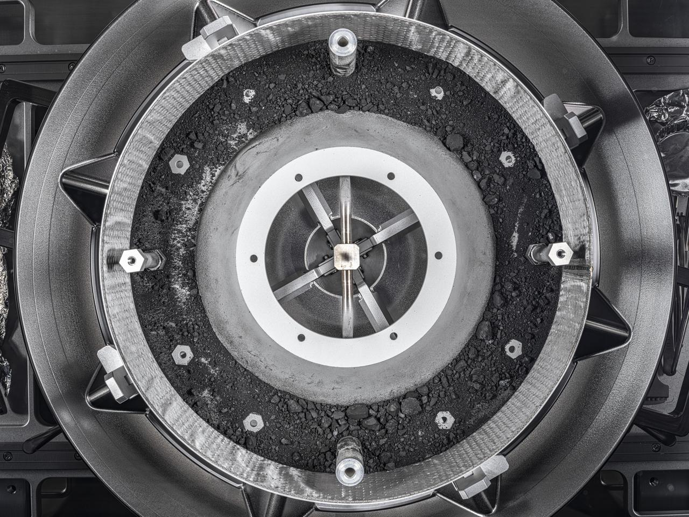

# 天问二号探测器成功发射

**摘要：** 北京时间2025年5月28日，天问二号探测器由长征三号乙运载火箭在西昌卫星发射中心成功发射。天问二号是中国首次实施小行星采样返回任务，探测器将前往一颗近地小行星进行伴飞探测并采集样本，计划于2030年前后将样本送回地球。该任务将为研究太阳系起源与演化提供重要科学数据。

*Credit: NASA (OSIRIS-REx任务图示，天问二号类似的小行星采样返回任务)*

## 信息来源（原文）

- 中国国家航天局：[天问二号任务新闻](https://www.cnsa.gov.cn/)
- 中国探月与深空探测网：[CLEP官方报道](http://www.clep.org.cn/)

> 来源采集自官方媒体公开报道，仅供学习参考。
