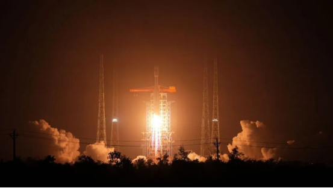

# 长征八号一箭十八星发射千帆星座第七批组网卫星

**摘要：** 2026年4月7日21时32分，在海南商业航天发射场，长征八号运载火箭以"一箭十八星"方式将千帆星座第七批组网卫星送入预定轨道，发射取得圆满成功。这是千帆星座建设进程中的又一重要里程碑。

*Credit: CNSA*

## 发射概况

2026年4月7日21时32分，在海南商业航天发射场，长征八号运载火箭以"一箭十八星"方式，将千帆星座第七批组网卫星送入预定轨道，发射取得圆满成功。

千帆星座（亦称"千帆低轨卫星互联网星座"）是我国自主建设的低轨卫星互联网星座，旨在为全球用户提供高带宽、低时延的卫星互联网接入服务。该星座规划部署超过1.5万颗卫星，是我国卫星互联网建设的核心工程之一。

## 千帆星座建设进展

千帆星座采用批量生产、组批发射的建设模式，自2024年启动组网以来，已成功完成七个批次的发射任务，在轨卫星数量持续增加。星座全部建成后，将实现全球覆盖，支撑我国卫星互联网产业规模化运营。

## 信息来源（原文）

- [我国成功发射千帆星座第七批组网卫星（国家航天局）](https://www.cnsa.gov.cn/n6758823/n6758838/c10738122/content.html)
