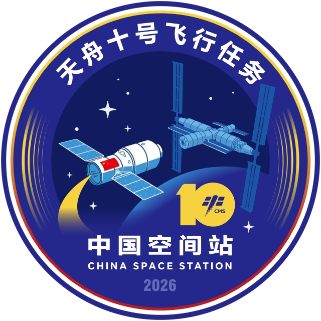

# 中国载人航天工程办公室正式发布天舟十号飞行任务标识

**摘要：** 2026年4月7日，中国载人航天工程办公室正式发布天舟十号飞行任务标识。该标识采用圆形设计，寓意任务圆满成功与天地协同的和谐统一；两侧金色渐变线条如光芒绽放，象征任务蕴含的蓬勃力量与辉煌成就。天舟十号是规划中的天舟货运飞船任务，计划于2026年执行。

*图片来源：中国载人航天工程网*

## 标识设计理念

天舟十号飞行任务标识的设计凝聚了丰富的文化内涵和航天精神：

- **圆形设计**：寓意任务圆满成功与天地协同的和谐统一
- **金色渐变线条**：两侧线条如光芒绽放，象征任务蕴含的蓬勃力量与辉煌成就，寓意中国航天事业的光辉灿烂
- **核心画面**：中心画面聚焦天舟货运飞船沿金色轨迹奔赴空间站的场景，直观呈现任务核心使命
- **数字融合**：视觉中心创新性地将数字"10"剪影与工程官方标识融合嵌套，传递出中国航天厚积薄发、使命必达的坚定信念
- **色彩运用**：以深邃太空蓝为主色调，象征航天任务在浩瀚宇宙中的精准运行；红金渐变交相辉映，象征航天人的无畏勇气与卓越追求

## 天舟货运飞船任务概况

天舟系列货运飞船是中国空间站的重要组成部分，承担着为空间站运输物资、推进剂补加等关键任务。天舟十号任务将在此前任务基础上继续为空间站的在轨运营提供保障。

## 信息来源（原文）

- [天舟十号飞行任务标识发布 - 中国载人航天工程网](http://www.cmse.gov.cn/xwzx/202604/t20260407_57375.html)
